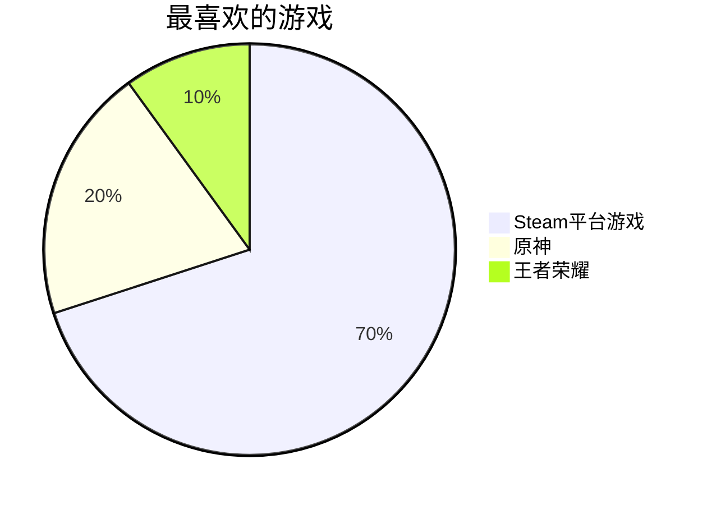
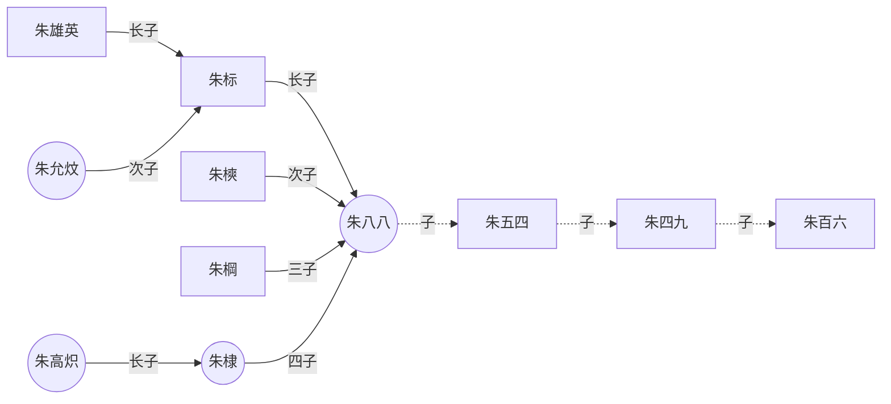

# 前言
&emsp;由于各个平台实现markdown的渲染不同，我仅仅是在自己使用的平台上进行的测试，因此，有‘部分适用’标签的代表其他平台不一定通用。

&emsp;请去[官网](https://markdown.com.cn/)查看通用语法。

---
# 标题
``` markdown
> # 标题1
> ## 标题2
> ### 标题3
```
> # 标题1
> ## 标题2
> ### 标题3
---

# 文字处理
``` markdown
**加粗**
*斜线*
***加粗加斜线***
<u>下划线</u>
~~删除线~~
H~2~O（部分适用）
3^2^=9（部分适用）
```
**加粗**
*斜线*
***加粗加斜线***
<u>下划线</u>
~~删除线~~
H~2~O（部分适用）
3^2^=9（部分适用）

---

# HTML标签
<span style="border-bottom:2px dashed yellow;">使用HTML的下划线</span>
<kbd>按键</kbd>
H<sub>2</sub>O
<b>加粗b标签</b>
<i>斜体i标签</i>
<em>斜体em标签</em>
3<sup>2</sup>=9

---

# 分点
## 有序
``` markdown
1. 这是第一点
2. 这是第二点
	1. 这是第二点中的第一点
	2. 这是第二点中的第二点
3. 这是第三点
```
1. 这是第一点
2. 这是第二点
	1. 这是第二点中的第一点
	2. 这是第二点中的第二点
3. 这是第三点

## 无序
```markdown
- 1
- 2
  - 2.1
  - 2.2
- 3
```
- 1
- 2
  - 2.1
  - 2.2
- 3
## 引用
```markdown
> 这是一条引用
>	> 这是嵌套引用
```
> 这是一条引用
>	> 这是嵌套引用

---

# 特殊（部分适用）
```markdown
&emsp;// 这是tab
&lt;// <
&amp;// &
&nbsp;// 小tab
&copy;// 著作权符号
```
&emsp;// 这是tab
&lt;// <
&amp;// &
&nbsp;// 小tab
&copy;// 著作权符号

---

# 代码块
``` markdown
   // 行内代码 `int a = 0;`
  // ```cpp
  // #include <iostream>
  // using namespace std;
  // int main(){
  //   	cout << "hello world" << endl;
  //  	return 0;
  // }
  // ```
  // 把 “//” 去除
```
行内代码 `int a = 0;`

```cpp
#include <iostream>
using namespace std;
int main(){
	cout << "hello world" << endl;
	return 0;
}
```

``` python
print("hello world")
```

``` json
{
	"hello" : 1,
   	"world": 3,
}
```
# 表格
``` markdown
| 头部1  | 头部2  | 头部3  | 头部4  |
| :-: | --: | :-: | :-- |
| 行1列1 | 行1列2 | 行1列3 | 行1列4 |
| 行2列1 | 行2列2 | 行2列3 | 行2列4 |
```
| 头部1  | 头部2  | 头部3  | 头部4  |
| :-: | --: | :-: | :-- |
| 行1列1 | 行1列2 | 行1列3 | 行1列4 |
| 行2列1 | 行2列2 | 行2列3 | 行2列4 |

# 公式
```markdown
`latex`公式
这是一个行内公式，$e=mc^2$ 是爱因斯坦的质能方程
下面是块公式
$$
\frac{分子}{分母} \\
\\
\lim\limits_{x\rightarrow\infty} \sin  \left(  \frac{1}{x} \right) \cdot x = 1 \\
\sum\limits^{\infty}_{i=0} \int ^ \infty _0 i di= 我也不知道
$$
```

`latex`公式
这是一个行内公式，$e=mc^2$ 是爱因斯坦的质能方程
下面是块公式
$$
\frac{分子}{分母} \\
\\
\lim\limits_{x\rightarrow\infty} \sin  \left(  \frac{1}{x} \right) \cdot x = 1 \\
\sum\limits^{\infty}_{i=0} \int ^ \infty _0 i di= 我也不知道
$$

---

# 图片与链接
``` markdown
[链接到主页](https://lmzyoyo.top)

```

[链接到主页](https://lmzyoyo.top)


---

# 转义字符
适用`\`来进行转义，如下字符都需要转义：
| 需要转义 |
| :-: |
| \\       |
| \*       |
| \_       |
| \`       |
| \{\}     |
| \(\)     |
| \[\]     |
| \#       |
| \+       |
| \-       |
| \.       |
| \!    |
| \|         |

---

# 画图

## mermaid介绍
[教程](https://mermaid.js.org/intro/)在官网可以看，左边有讲哪些图
使用`mermaid`代码块即可，下面讲讲`mermaid`基本语法：
``` markdown 
```mermaid
关键字 关键字内容
mermaid代码块
\```  注意‘\’需要去除
```

- Mermaid能绘制哪些图？

| 图类型     | 关键字          |
| :-: | :-: |
| 饼状图     | pie             |
| 流程图     | graph           |
| 序列图     | sequenceDiagram |
| 甘特图     | gantt           |
| 类图       | classDiagram    |
| 状态图     | stateDiagram    |
| 用户旅程图 | journey         |

## 饼状图
```markdwon
pie
    title 最喜欢的游戏
    "Steam平台游戏" : 70
    "原神" : 20
    "王者荣耀" : 10
```

显示如下：




## 流程图[^zhihu]
``` markdown 
graph LR
# graph TB 从上往下
# graph RL 从右往左
emperor((朱八八))-.子.->朱五四-.子.->朱四九-.子.->朱百六
朱雄英--长子-->朱标--长子-->emperor
emperor2((朱允炆))--次子-->朱标
朱樉--次子-->emperor
朱棡--三子-->emperor
emperor3((朱棣))--四子-->emperor
emperor4((朱高炽))--长子-->emperor3
```
显示如下：



---

# 引用与脚注
注意看，这里自动排好序了，按照引用的先后顺序
```markdown
&emsp;我将引用一段维基百科的内容：[^haha3]

&emsp;乔治·约翰特·里·马洛里（英语：George Herbert Leigh Mallory；1886年6月18日－1924年6月8日或9日）[^font1]是英格兰探险家，在尝试攀登西藏的珠穆朗玛峰途中丧生。

&emsp;他在被问及为何想要攀登珠穆朗玛峰时回答说：“因为它就在那里。”（Because it's there.）或译：“因为山就在那里。”成为人们至今经常引用的名言[^font2]。

在文章结尾将写下：

[^font1]: Davis, Wade, Into The Silence: The Great War, Mallory and the Conquest of Everest, Bodley Head, 2011, pp. 546–7
[^font2]: "Climbing Mount Everest is Work for Supermen".. The New York Times. 18 March 1923. [2019-03-12]. （原始内容存档于2014-03-08）.
[^haha3]: [维基百科内容](https://zh.wikipedia.org/wiki/%E4%B9%94%E6%B2%BB%C2%B7%E9%A9%AC%E6%B4%9B%E9%87%8C#cite_note-2)
```

&emsp;我将引用一段维基百科的内容：[^haha3]

&emsp;乔治·约翰特·里·马洛里（英语：George Herbert Leigh Mallory；1886年6月18日－1924年6月8日或9日）[^font1]是英格兰探险家，在尝试攀登西藏的珠穆朗玛峰途中丧生。

&emsp;他在被问及为何想要攀登珠穆朗玛峰时回答说：“因为它就在那里。”（Because it's there.）或译：“因为山就在那里。”成为人们至今经常引用的名言[^font2]。

在文章结尾将写下：

[^font1]: Davis, Wade, Into The Silence: The Great War, Mallory and the Conquest of Everest, Bodley Head, 2011, pp. 546–7
[^font2]: "Climbing Mount Everest is Work for Supermen".. The New York Times. 18 March 1923. [2019-03-12]. （原始内容存档于2014-03-08）.
[^haha3]: [维基百科内容](https://zh.wikipedia.org/wiki/%E4%B9%94%E6%B2%BB%C2%B7%E9%A9%AC%E6%B4%9B%E9%87%8C#cite_note-2)
[^zhihu]: [知乎内容](https://zhuanlan.zhihu.com/p/355997933)