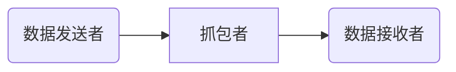
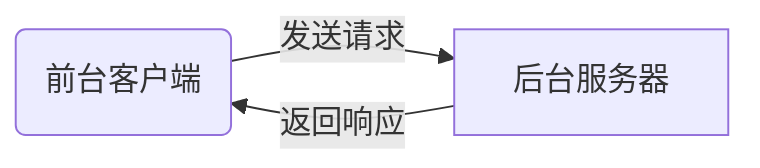
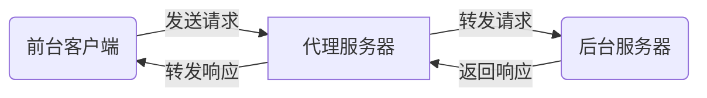

# `Python`爬虫入门教程

---

## 基础知识

### 什么是`HTML、CSS、JavaScript`

> 网页往往采用`html+css+js`开发，`html`是一门标记语言
>
> 如下：
>
> ```html
> <!- 将下面这句话放入html文件中，-->
> <!- 然后浏览器就会将这句话解释为下面那张图片，-->
> <!- 这个就是浏览器渲染的功能-->
> <!- 这里我们知道了一个词——浏览器的渲染   -->
> <!- 并且我们发现，浏览器会在下面这个网址 自动 -->
> <!- 把这张图片下载下来，然后渲染给我们看，这在我们之后抓包会有用 -->
>  width="300px">
> ```
>
> 

### 什么是请求，什么是响应

> 请求：就是前端向后端发送一个请求，如请求我的账户浏览记录
>
> 响应：就是后端向前端发送一个响应，你请求你的账户浏览器记录，那么我把记录发给你，叫做响应
>
> `JavaScript`中有请求，浏览器渲染到其中的请求，就会向后端发送请求

### 什么是`GET`，什么是`POST`

> 这个是两种请求方式而已，`get`直接把请求数据放在链接里面，`post`一般以则不是

### 什么是`Cookie`

> 曲奇饼干？不是
>
> 打个比方，大家申请出校，需要在手机上申请，然后今天一天都可以通过刷脸进出校园
>
> 那么，在手机上申请相当于告诉学校后端，你请求了进出校权限。也相当于，你在网页上登录账户密码
>
> 然后，你一天可以通过刷脸，这个刷脸就是`cookie`，今天进出校园不需要再申请了
>
> 这个就是`cookie`的作用，最常见的就是，不需要每次点开一个页面都进行账户密码登录

### `Python`基本语法

> 这个本该大家自己去学习的，但是这里说好基础入门，就简单提一点点
>
> ```python
> a = 1
> b = 2
> # if结构
> if a > b:
>  print("a大于b")
> else:
>  print("a不大于b")
> 
> # while循环
> while True:
>  print("这里面是while循环")
> 
> # 列表和字典
> m = ["hello", 2, 4.5]  # 列表支持不同数据类型，并且可以随意扩充和删减
> n = {			# 字典里面每个元素都是   键值:值   组成
>  "key1": 3,
>  "key3": "hello"
> }
> m[0]    ## 索引到第0个元素，即 "hello"
> n["key1"]   ## 索引到键值为"key1"的值，即 3
> ```

### 什么是抓包

> 打个比方：你要向某人发一条数据，我在你们之间截获了或者记录了你们的数据，这个叫做抓包




> **那么我们需要抓什么包呢？抓包的用处在哪呢？**
>
> 答：我们需要抓取浏览器和后端服务器通信的包；用处是分析他们的数据然后用代码进行伪造数据发送，以便获得和浏览器同样的响应

### 什么是代理

> 不进行代理应该是下列图：



> 代理就是如下：




### 如何伪造呢？

> 1、一般网站开发者希望我们使用浏览器浏览他们的网站，不希望我们使用代码进行浏览
>
> 2、欸，但我就想用代码进行浏览，怎么办呢？
>
> 3、那么就需要将我们的代码尽量伪装成浏览器，让后端以为我们是浏览器
>
> 4、具体就是抓包，分析数据，用代码发送请求

---

## 浏览器抓包

### 进入调试模式

> 打开某个浏览器，按下键盘上的<kbd>F12</kbd>键，进入调试模式
>
> 
>
> 一般用得到上面四个红圈里面的内容，建议跟我一样，将这个调试界面放到右侧，不然之后找不到对应的按钮（仅代表个人习惯）。
> 如果是英文的，也不要担心，相信这点英文应该看得懂，看不懂应该也能找到相应位置，还可以自行百度怎么换成中文哦。
>
> 

> - 红圈1、找到页面上的元素分别对应哪句`html`标签
> - 红圈2、主要看<kbd>元素</kbd>和<kbd>网络</kbd>两个
> - 红圈3、左边如果是红色表示正在抓包记录，右边是清除已经抓到的包记录
> - 红圈4、一般我喜欢直接点选<kbd>全部</kbd>这个按钮，其他的是过滤数据的类型

### 如何寻找数据呢？

> 
>
> 我们首先需要伪造成浏览器，发送请求标头，然后分析一下响应的数据，这个就是一个抓包过程啦
>
> 听起来是不是很简单呢？
>
> <kbd>简单</kbd> 打在公屏上

---

## 分析数据

### 浏览器人性化查看数据

> <center></center>
>
> 第一张图和第二张图有所区别，多了一个<kbd>载荷</kbd>选项，因为第二张图是在百度翻译上面抓的
>
> 第二张图发送请求时候带了参数，所以比第一张图多了<kbd>载荷</kbd>选项

### 分析请求标头

> **这么多的数据，我应该怎么办呢？**
>
> - `User-Agent`：这个相当于浏览器标识，看你是什么浏览器发送的，我们直接用这个就行`Mozilla/5.0 (Windows NT 10.0; Win64; x64) AppleWebKit/537.36 (KHTML, like Gecko) Chrome/96.0.4664.110 Safari/537.36`，这个代表是`chrome`浏览器的标识
> - `Referer`：它其实是`refer`，就是代表这个网也从哪个网页来的
> - `cookie`：就是`cookie`，前面基础知识提到过
> - `请求网址`：就是你向哪个网址发送请求，请求的对象是哪个
>
> **查看载荷**
>
> 如上面第二张图中的请求网址是：
>
> 分为前后两部分组成，后面那部分就是载荷了，它是多个<kbd>字符串参数</kbd>，然后它是这么个形式：<kbd>键值=值</kbd> 组成的
>
> 多个<kbd>字符串参数</kbd>用`&`链接起来，把他人性化一点查看就是这样：<kbd>字符串参数</kbd>
>
> 
>
> **POST请求不仅仅只有请求头还有请求数据**
>
> 下面是百度翻译的`post`请求的载荷
>
> 
>
> 上面和`get`请求一样，是<kbd>字符串参数</kbd>，下面就是<kbd>表单数据</kbd>，这个是很重要的一个部分

这些都是基础概念，之后会用到，现在先学学

### 分析响应数据

> 响应数据多种多样，常见的有：`html`文本，图片文件，表单数据，视频文件等等
>
> 其中，图片文件和视频文件等都是二进制格式
>
> `html`文本和表单数据是文本格式

> - `html`文本
>
> 一般都需要请求这个，它会告诉浏览器需要<kbd>渲染</kbd>什么，如下载哪张图片，下载哪个音频，下载哪个文件等等
>
> 我们一般都需要分析一下这个文件
>
> - 图片文件
>
> 直接以二进制的形式写入本地就相当于下载下来
>
> - 表单数据
>
> 返回的数据中一般带有我们需要的数据，如翻译的请求，就会把翻译的结果再以表单的形式返回了

## 代码编写

有了上述的知识，可以进行代码编写，其实完全可以先进行代码编写，然后再去上述补充基本知识，这个顺序可以根据大家喜好来看。

[***`requests`教程***](https://docs.python-requests.org/zh_CN/latest/user/quickstart.html)

#### 导入`requests`包

> 下载：`pip install requests`
>
> 导入：`import requests`
>
> `emmmmm `怎么说呢，这个好像不如跟着视频里面做一遍，虽然我还没有录视频，但是聪明的你们肯定会上百度吧

#### `requests`包的使用

> 这个教程顺序可能和网上很多都不一样
>
> ```python
> import requests as rq
> import json
> import re
> 
> tool = rq.session()   # 这个会返回一个爬虫工具箱，并且它会自动维持cookie
> 
> verify=False   # 设置是否进行SSL验证，一般设置为否
> url="https://baidu.com"  # 这里请求百度的数据
> headers={   # 设置请求头
>  "User-Agent": "Mozilla/5.0 (Windows NT 10.0; Win64; x64) AppleWebKit/"
>   "537.36 (KHTML, like Gecko) Chrome/96.0.4664.110 Safari/537.36",
> }
> proxies={    # 设置代理
>  "http": None,
>  "https": None
> }
> params={   # 设置字符串参数
> 
> }
> data={  # 设置请求表单
> 
> }
> 
> # 发送get请求，得到get响应
> responseGet = tool.get(url=url, params=params, headers=headers, verify=verify, proxies=proxies)
> # 发送post请求，得到post响应
> responsePost = tool.post(url=url, data=data, headers=headers, verify=verify, proxies=proxies)
> 
> # 解析响应
> # 1、假如响应是文本数据，如html文本
> response = responseGet
> response.content # 这个是内容，是二进制编码
> response.content.decode("gbk")  # 使用gbk解码，不加参数就是utf-8解码
> # 2、假如响应是图片数据
> with open("1.png", "wb") as f:
>  f.write(response.content)   # 直接以二进制写入文件
> # 3、假如响应是表单数据
> dat = json.loads(response.content.decode())   # 返回的就是一个字典数据了
> 
> ```

#### 正则表达式简单用法

> 爬虫中的正则表达式一般会比较简单
>
> ```python
> import re   # 导入正则表达式包
> # 假如有下列字符串需要被匹配
> # str1 = "<link href="https://stacdn.proginn.com/plugin/swiper/swiper.min.css?version=4.30.2"
> # rel="stylesheet" type="text/css">"
> # 其中href中的是我们需要的那么
> html = response.content.decode()
> restr = "<link\\shref=\"(.*?)\"\\srel=\"stylesheet\"\\stype=\"text/css\">"
> dst_list = re.findall(restr, html)   # 返回一个列表
> # 上面这条语句，会将html里面所有形如str1中的href都返回到列表中
> 
> # 假如我们是要爬取妹妹图，那么就把当前页面所有的妹妹图的网址都保存到列表了
> # 只需要进行如下操作遍历列表就行
> for pngurl in dst_list:
>  	print(pngurl)
> ```

---

# 结束语

​		爬虫会涉及到有关法律问题，这里不作讨论，但是希望大家不要拿来干坏事。***概不负责***。

​		爬虫与反爬、反反爬一直都在相互进行着，是相互迭代的过程，爬虫重点在于数据分析而不是代码编写。

​		本课程涉及的只是非常非常简单的爬虫，还有很多很多爬虫知识需要后续的学习，爬虫涉及的知识太广了，不是一堂课能够讲的清楚的。涵盖网络知识、密码知识、前后端工作方式、编码格式等等。之后应该学校课程有一门叫做<kbd>《计算机网络技术》</kbd>，我个人感觉这门课程非常重要，但是其实学校老师讲的可能`emmmmmm...`。大家可以课外多花时间学习，不管之后是嵌入式，物联网，互联网，软件开发，网络安全、科学上网等等方向都需要用到计算机网络的知识。

​		任重而道远，我学这个是凭借着兴趣而学习，所以更多的知识还是得看自己慢慢学。之后我如果有时间，应该会录制两三个爬虫例子。如爬取二次元桌面图片、一键登录校园网、获取天气预报、打造一个翻译官等等。