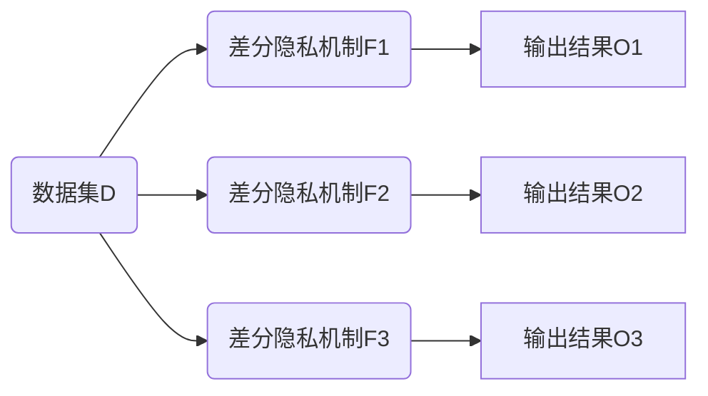
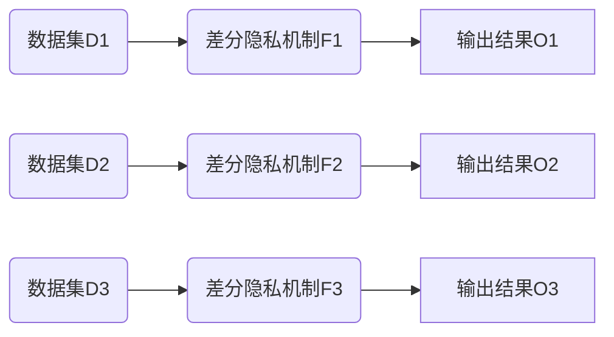

# 前言

前面已经记录了差分隐私的学习过程，最近在看论文的过程中又有些收获，决定记录一下。

# 一句话概括

差分隐私：两个**相似**的**数据集**，分别经过**机制**的作用之后，会得到**机制值域**中对应的两个值，差分隐私是随机的，那么这两个值是有**概率相等**，这个概率如果满足一定**约束**，那么称该**机制**满足**约束参数-差分隐私**。

# 相似的数据集

什么是相似的数据集呢？差分隐私中，往往使用**邻近数据集**来表示这个相似数据集。那么，什么又是邻近数据集呢？引入数据集的距离概念来描述这一定义。

对于按行存储的两个数据集来说（这也是常用的数据集，比如关系型数据库的表），距离定义为两个数据集的对称差，如下公式所示：
$$
d(x,x')=|x-x'\cup x'-x|
$$
其中，$x,x'$是两个数据集。

-   如果$x′$是通过向$x$*添加一行*来构造的，则$d(x,x′)=1$
-   如果$x′$是通过从$x$*删除一行*来构造的，则$d(x,x′)=1$
-   如果$x′$是通过在$x$*修改一行*来构造的，则$d(x,x′)=2$
-   如果$d(x,x')=1$，那么称$x,x'$为**邻近数据集**。

# 机制值域

一个机制定义为$F:\mathcal{D}\rightarrow \mathbb{R}/\mathbb{R}^n$，这里机制详解会在后面得到，这里只需要把它理解成将一个数据集对应到一个`实数/整数/实数向量/整数向量`等**值**即可，所有这些可能取得的值就叫做值域。非常好理解，就是所有数据集对应的值的集合称为值域。

# 约束参数-差分隐私

## 两种基本差分隐私

这里及后面部分是互相关联的，这里仅仅简单介绍一下。

现在我们回到最开始的那句话，满足 `约束参数-差分隐私`，这是描述某个差分隐私**机制**满足什么样的差分隐私的。常用的差分隐私就$\epsilon$-差分隐私或者$(\epsilon,\delta)$-差分隐私两种，其他形如 `参数-差分隐私`的，一般可以化成这两种，而且最常用的是 $(\epsilon,\delta)$-差分隐私。我们在后面的章节讨论什么机制满足哪种差分隐私，这里仅仅讨论这两种差分隐私的含义及性质。

下面给出这两种差分隐私的公式定义：
$$
\Pr[F(x)=S]\leq \text{e}^{\epsilon}\Pr[F(x')=S]\\
\Pr[F(x)=S]\leq \text{e}^{\epsilon}\Pr[F(x')=S]+\delta
$$
其中，$x,x'$为两个邻近数据集，$F$为一种差分隐私机制，$S$为机制值域中的任意一个值，$\Pr[\cdot]$表示概率，$e$表示自然底数。这两个差分隐私有一个共同点，即 $\epsilon$。而且，这两种其实就是后面是否增加一个$\delta$而已，其他的不用过多解释，下面就对这两个参数进行解释即可。第一个称为纯粹差分隐私，第二个也称为近似差分隐私。

-   $\epsilon$：$\geq0$，称为单词查询消耗的隐私预算（Privacy Budget）或隐私参数（Privacy Parameter），论文中一般称之为预算。

    -   与输出的关系：

        >   $\epsilon$越小，$F$对于数据集$x,x'$的输出越相似，攻击者越无法区分两个数据集了。
        >
        >   $\epsilon$约大，$F$对于数据集$x,x'$的输出越不相同，攻击者越容易区分两个数据集了。
        
    -    与隐私消耗量的关系：

         >   其含义定义为隐私预算（或隐私消耗量可能的最大值）
         >
         >   隐私预算越大，我有更多的隐私可以用来消耗，也就是我可以更多地泄露隐私。
         >
         >   隐私预算越小，我没有那么多的隐私可以用来消耗了，我一点隐私都不能泄露。
         >
         >   所以其可以用来表示为隐私消耗量的上界，或者一些情况下直接称其为**隐私消耗量**也可以，毕竟其含义就是最坏情况下隐私的消耗量。

-   $\delta$：$0<\delta<1$，称之为纯粹差分隐私的失败概率，即有$\delta$的概率，机制不满足纯粹差分隐私，有$1-\delta$的概率，这个机制满足纯粹差分隐私，也就是对纯粹差分隐私的一个宽松约束的调节。一般取值很小，通常为$1/n^2$，$n$为数据集大小。

## 两种基本差分隐私的性质

### 后处理性

通俗来说，经过了差分隐私机制之后，后续随便经过什么处理，都不会破坏前面经过差分隐私机制得到的隐私保护强度。

数学定义：如果$F(\cdot)$满足$\epsilon$-差分隐私（或$(\epsilon,\delta)$-差分隐私），对于任意一个其他函数$G(\cdot)$，有$G(F(\cdot))$均满足$\epsilon$-差分隐私（或$(\epsilon,\delta)$-差分隐私）。

这一性质说明，只要经过差分隐私处理之后，隐私都可以得到前面差分隐私的保证。那么如果后面继续经历差分隐私呢？那就可以看看下面的性质。

### 串行组合性



串行组合性：如果同一个数据集会经过不同差分隐私机制$F_1,F_2,\dots,F_n$之后产生不同的输出结果$O_1,O_2,\dots,O_n$，且这些输出结果均会被暴露，那么这就是串行组合。常应用于机器学习中。

如果$F_1,F_2,\dots,F_n$分别满足$\epsilon_1,\epsilon_2,\dots,\epsilon_n$-差分隐私（或$(\epsilon_1,\delta_1), (\epsilon_2,\delta_2),\dots,(\epsilon_n,\delta_n)$-差分隐私）那么经过串行组合之后，整个满足$\epsilon_1+\epsilon_2+\dots+\epsilon_n$-差分隐私（或$(\epsilon_1+\epsilon_2+\dots+\epsilon_n,\delta_1+\delta_2\dots+\delta_n)$-差分隐私）

### 并行组合性



并行组合性：如果$D_1,D_2,\dots,D_n$是数据集$D$中不相交的$n$个子数据集，$F_1,F_2,\dots,F_n$是相互独立的$n$个差分隐私机制，且分别提供$\epsilon_1,\epsilon_2,\dots,\epsilon_n$-差分隐私（或$(\epsilon_1,\delta_1), (\epsilon_2,\delta_2),\dots,(\epsilon_n,\delta_n)$-差分隐私），那么整体会提供$\max\limits_{1\leq i\leq n}\epsilon_i$-差分隐私（或$(\max\limits_{1\leq i\leq n}\epsilon_i, \max\limits_{1\leq i\leq n}\delta_i)$-差分隐私）。


下面来看看串行和并行的隐私预算区别：

如果$F(X)$满足$\epsilon$-差分隐私性，我们将数据集$X$切分为$k$个互不相交的子数据块$x_1\cup\dots\cup x_k=X$，则发布所有结果$F(x_1),\dots,F(x_k)$的机制满足$\epsilon$-差分隐私性，也就是总体隐私消耗量也只有$\epsilon$，如果是串行的话，总体隐私消耗量其实是$k\epsilon$，显然并行更能保护隐私一点。


## 差分隐私的一些变体

值得注意的是，一些变体的差分隐私的性质需要单独讨论，但是如果可以化成前面两种差分隐私，就可以借助前面两种差分隐私的性质讨论。

由于这一部分内容较多，选择在后面单独一章展开

# 机制

机制应该是由最起码两部分组成，一部分是**问询**机制，一部分是**差分隐私**机制。问询机制，自然是你需要获取数据集的什么数据，比如均值问询，求和问询，数量问询等等。差分隐私机制是在问询过后，对问询结果做的隐私保护机制，比如加噪声，混淆，裁剪等。接下来会从问询机制和差分隐私机制两个方面展开介绍。

## 问询机制

### 敏感度

敏感度分为全局敏感度和局部敏感度，如果问询结果是实数，那么敏感度就是实数之差，非常好计算。如果问询结果是向量呢，那么就需要用到范数了。因此，先稍微回顾一些基础知识吧。

-   范数（Norm）：通常用于描述向量的长度，或者两个向量的距离，详见[范数](https://zh.wikipedia.org/wiki/%E8%8C%83%E6%95%B0)。设当前有向量$\alpha=(a_1, a_2,\dots,a_n),\beta=(b_1,b_2,\dots,b_n)$，那么其距离范数如下

    >   $l_1$范数：$\|\alpha-\beta\|_1=\sum\limits_{i=1}^n|a_i-b_i|$
    >
    >   $l_2$范数：$\|\alpha-\beta\|_2=\sqrt{\sum\limits_{i=1}^n(a_i-b_i)^2}$
    >
    >   无穷范数：$\|\alpha-\beta\|_\infty=\max\limits_i(|a_i-b_i|)$

接下来，需要先介绍一下全局敏感度和局部敏感度，千万不要忘了敏感度是对于问询机制而言的，也就是一个确定的函数。敏感度常常用$\Delta$来表示，比如$\Delta f$表示$f$问询机制的敏感度。

-   全局敏感度：任意两个邻近数据集$x,x'$及一个问询函数$f$，那么可以定义其全局敏感度定义如下

    >   $\text{GS}(f)=\max\limits_{x,x':d(x,x')\leq1}|f(x)-f(x')|$
    >
    >   全局敏感度的意思就是，任意两个邻近数据集经过问询机制$f$之后差异的最大值是多少。

-   局部敏感度：局部敏感度会跟具体的数据集有关，定义如下

    >   $\text{LS}(f)=\max\limits_{x':d(x,x')\leq1}|f(x)-f(x')|$
    >
    >   局部敏感度的意思是，对于数据集$x'$来说，其所有可能邻近数据集与其经过问询机制之后差异的最大值是多少。
    >
    >   局部敏感度研究的意义是什么呢？意义在于敏感度本身就会泄露一些信息，因此很多研究内容在于让敏感度本身也具有差分隐私。


# 差分隐私的变体

## 最大散度与差分隐私

在统计学中，散度（Divergence）是描述两个分布之间差异性的度量，这是差分隐私最基本的思想，隐私差分隐私变体基本都是从散度中而来的。

最大散度是KL(Kullback-Leibler)散度的一个最坏情况，下面是KL散度的定义：
$$
\begin{align}
D_{KL}(P\|Q)&=\sum\limits_{i}P(i)\ln\frac{P(i)}{Q(i)},(离散)\\
&=\int_{-\infty}^{+\infty}p(x)\ln\frac{p(x)}{q(x)}dx,(连续)
\end{align}
$$
其中，$P,Q$表示两个分布，$P(i)$（或$p(x)$）表示离散分布$P$中$x=i$的概率（或连续分布$P$中，$p(x)$为概率），$Q$是同理的。

一些特征如下：

-   $D_{KL}(P\|Q)\neq D_{KL}(Q\|P)$
-   $D_{KL}(P\|Q)\geq0$，当前仅当$P=Q$时才取0


与差分隐私的联系：

假设两个邻近数据集$x,x'$以及一个差分隐私函数$F$满足如下式子：
$$
D_{KL}(F(x)\|F(x'))\leq \epsilon
$$
那么可以说$F$满足$\epsilon$-差分隐私。

## 瑞丽散度与差分隐私

瑞丽散度（Rényi divergence）也是一种描述散度的方式，下述为公式
$$
D_\alpha(P\|Q)=\frac{1}{\alpha-1}\ln\left[\text{E}_{x\sim Q}\left[\left(\frac{P(x)}{Q(x)}\right)^\alpha\right]\right]
$$
其中，$\alpha$是一个被称为瑞丽阶或者瑞丽秩序熵（entropy of order）的量，取值为$\alpha\in(0,1)\cup(1,+\infty)$；$\text{E}_{x\sim Q}$表示所有$\forall x\in Q$的期望。

与差分隐私的联系：

假设两个邻近数据集$x,x'$以及一个差分隐私函数$F$满足如下式子：
$$
D_\alpha(F(x)\|F(x'))\leq\overline\epsilon
$$
那么可以说$F$满足$(\alpha,\overline\epsilon)$-瑞丽差分隐私，其一定满足$(\epsilon,\delta)$-差分隐私，其中有$\delta>0,\epsilon=\overline\epsilon+\log(1/\delta)/(\alpha-1)$，一般来说，$\delta\leq 1/n^2$，其中$n$表示数据集大小。

前面说到$\alpha\neq1$，其实在1处也有定义，$D_1(P\|Q)=\lim\limits_{\alpha\rightarrow1}D_\alpha(P\|Q)=D_{KL}(P\|Q)$。

串行组合瑞丽差分隐私则满足$(\alpha,\overline\epsilon_1+\overline\epsilon_2+\dots+\overline\epsilon_n)$-差分隐私，此时转换成两种基本的差分隐私，可以发现其满足$(\epsilon_1+\epsilon_2+\dots+\epsilon_n-\frac{k\ln(1/\delta)}{\alpha-1})$-差分隐私，可以看出比直接组合差分隐私会有更小的隐私预算。

值得注意的是，瑞丽差分隐私应用非常广泛。

## 零集中差分隐私

零集中差分隐私(Zero-concentrated Differential Privacy，zCDP)仍然使用瑞丽散度，不过其满足式子不一样：
$$
D_\alpha(F(x)\|F(x'))\leq\rho\alpha
$$
称$F$满足$\rho$-零集中差分隐私，可以把他转换成近似差分隐私，$F$满足$(\epsilon,\delta)$-差分隐私，其中$\epsilon=\rho+2\sqrt{\rho\ln(1/\delta)}$。

串行组合零集中差分隐私则满足$\rho_1+\rho_2+\dots+\rho_3$-零集中差分隐私

## 差分隐私机制

### 拉普拉斯机制

拉普拉斯(Laplace)机制的实现就是，在问询结果后面增加拉普拉斯噪声，先介绍拉普拉斯分布
$$
f(x)=\frac{1}{2b}\exp\left(-\frac{|x-\mu|}{b}\right)
$$
其中，$\mu$是位置参数，$b$是尺度参数，差分隐私中，一般$\mu$都是0。

拉普拉斯机制的差分隐私：
$$
F(x)=f(x)+\text{Lap}(\frac{\Delta f}{\epsilon})
$$
称$F$满足$\epsilon$-差分隐私，如果是向量值，则必须使用$L_1$范数来描述敏感度。

### 高斯机制

高斯(Gaussian)机制的实现就是，在问询结果后面增加高斯噪声，先介绍高斯分布（正态分布）
$$
f(x)=\frac{1}{\sigma\sqrt{2\pi}}\exp\left(-\frac{(x-\mu)^2}{2\sigma^2}\right)
$$
其中，$\mu$是均值（或者位置参数），$\sigma^2$是是方差（尺度参数）差分隐私中，一般$\mu$都是0。

高斯机制的差分隐私：
$$
F(x)=f(x)+\mathcal{N}(\sigma^2)\\
\sigma^2=\frac{2(\Delta f)^2\ln(1.25/\delta)}{\epsilon^2}
$$
称$F$满足$(\epsilon,\delta)$-差分隐私，如果是向量值，可以使用$L_1,L_2$来描述敏感度。

### 指数机制

可以看出，前面的拉普拉斯和高斯都是要求连续型的问询。对于离散问询，比如分类问题等，那么加了一些小噪声可能意义不大。

其核心思想是，从备选回复中有选择性的回复一个问询。当然，也有可能回复真实值，但是这是满足差分隐私的。详细过程如下：

1.   选择一个备选集合$\mathcal{R}$
2.   指定一个评分函数$u:\mathcal{D},\mathcal{R}\rightarrow\mathbb{R}$
3.   按照概率输出$r\in\mathcal{R}$，每个元素的概率是：$\exp\left(\frac{\epsilon u(x,r)}{2\Delta u}\right)$，其中$x$是整个数据集，$r$是备选集合中的每个元素，$\Delta u=\max\limits_{x,x':d(x,x')\leq1}|u(x,r)-u(x',r)|$是$u$在$x$下的全局敏感度。

上面三条说明指数机制会满足$\epsilon$-差分隐私。指数机制有一些特点：

-   备选集合里面的数量不影响总的隐私消耗量，即无论备选集合数量是多少，隐私消耗量都是$\epsilon$
-   备选集合可以是有限或者无限集合
-   指数机制代表$\epsilon$-差分隐私的基本机制，构造合适的评分函数，其他$\epsilon$-差分隐私机制都可以用指数机制定义

### 稀疏向量技术

有一串灵敏度为1的问询序列，想对数据集进行问询。稀疏向量技术只会返回其中一个，是否返回则是根据噪声和阈值来确定。

其实现具有很多种，这里通过伪代码的方式介绍其简单实现：

算法输入均是敏感度为1的问询流`queries`，数据集`Dataset`，阈值`T`以及隐私参数`epsilon`

高于阈值算法（Above Threshold）：

```python
def above_threshold(queries, Dataset, T, epsilon):
    T_hat = T + Laplace(2/epsilon)  # 增加拉普拉斯噪声
    for idx, query in enumerate(queries):
        noise_i = Laplace(4/epsilon)
        if query(Dataset) + noise_i >= T_hat:
            return idx  # 只返回第一个满足阈值的问询序号
    return random.sample(len(queries)) # 必定返回成功
	return -1 # 有可能返回失败
```

其满足$\epsilon$-差分隐私，串行组合满足$\epsilon_1,\epsilon_2,\dots,\epsilon_n$-差分隐私。

假如有一个问询序列${q_1,q_2,\dots,q_n}$，如果希望返回$k$个，那么就可以多次应用稀疏向量技术：

-   首次应用稀疏向量技术，返回第$i$个
-   更新问询序列为$q_{i+1},q_{i+2},\dots,q_n$，继续应用稀疏向量技术
-   重复上述过程

其满足$k\epsilon$-差分隐私

下面给出一个稀疏向量技术的应用例子：

```python
def query_sum_clip(Dataset, b): # 获取设定上界裁剪后的总和
    d = Dataset.clip(lower=0, upper=b)  # 所有大于b的都被设定为b，所有小于0的被设定为0
    return d.sum()  # 返回求和
```

显然，这里的`query_sum_clip`这个问询不是灵敏度为1的，构造下面问询

```python
def query_b(b):
    def fun(Dataset):
	    query_sum_clip(Dataset, b) - query_sum_clip(Dataset, b+1)
    return fun
```

加入在数据集`Dataset`中增加一行数据，那么`query_sum_clip(Dataset, b)`的结果最多增加`b`（其灵敏度为`b`），而`query_sum_clip(Dataset, b+1)`则最多增加`b+1`，所以`query_b(Dataset, b)`则最多增加`1`，灵敏度就是`1`了。紧接着，定义一系列问询

```python
bs = range(1, 150, 5)  # 从1-150，步长为5
queries = [query_b(b) for b in bs]
epsilon = 0.1 # 隐私预算
T = 0 # 阈值
idx = above_threshold(queries, Dataset, T, epsilon)
assert idx != -1, "返回失败结果"
print(bs[idx])  # 返回第idx个问询结果
```

现在需要对稀疏向量进行一个回顾了，如果我们有一堆灵敏度为1的问询，并且如果我们只对其中一个或少数几个答案感兴趣，那么稀疏向量技术是一个非常好的方法，

### 随机响应

随机响应来自于1965年的论文，当时还没有差分隐私的概念，下面给出这个机制的最简单方法。

1.   掷一枚硬币
2.   硬币正面向上，如实回答问题
3.   硬币反面向上，再掷一枚硬币
4.   如果第二枚硬币正面向上，回答是，否则回答否

该随机响应方法满足$\epsilon$-差分隐私，其中$\epsilon=\ln(3)=1.09$

现在假设一个数据集大小为$N$，数据集里面对某个问题返回`是`的真实比例为$n\in(0,1)$，现在有一个二项分布，二项分布为`1`的概率为$p$。

对于任何一个样本数据，返回`是`和`否`的概率分别为：
$$
P(是)=n(p+(1-p)p)+(1-n)((1-p)p)=np+p-p^2\\
P(否)=n((1-p)(1-p)) + (1-n)(p+(1-p)*(1-p))=-pn+1-p+p^2\\
$$
开始对$n$应用最大似然估计，假设统计中回答是的人数为$N_1$，看看真是比例和估计比例差距，构造似然函数并求估计值：
$$
L(n)=(np+p-p^2)^{N_1}(-np-p+p^2+1)^{N-N_1}\\
\ln L(n) = N_1\ln (pn+p-p^2)+(N-N_1)\ln(-pn-p+p^2+1)\\
\frac{\text{d}\ln L(n)}{\text{d}n}=\frac{pN_1}{pn+p-p^2}-\frac{p(N-N_1)}{-pn-p+p^2+1}=0\\
\hat n =
$$
最终得到其满足$\epsilon$-差分隐私，且$\epsilon=\ln\frac{p}{1-p}$，中间具体证明过程略。

# 组合理论

前面讲的串行和并行是基本组合理论（Composition Theorem），接下来要将的是高级组合理论。基础组合理论中，任何两次查询之间都是相互独立的，但是真实情况下，两次查询未必独立，这就需要用到高级组合理论来计算隐私预算了。并且，简单地组合理论只是明确了隐私预算的上界，但是高级组合理论可以缩小这个上界（从理论出计算得到，并非采用什么机制实际去缩小）。

## Navie Composition Throrem

## Strong Composition Throrem

## Moments Accountant

这个应用比较广泛，着重讲讲这个，毕竟他是Deep Learning with differential privacy中提出来的。


