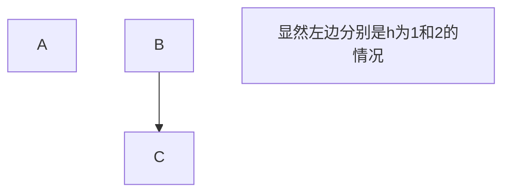
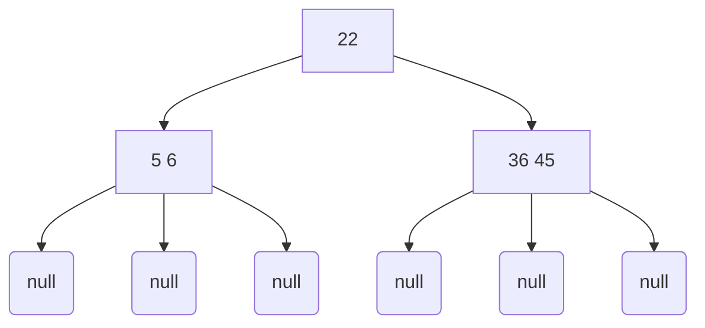

# 查找大法

## 1、顺序查找与二分法查找

---
## 2、顺序二叉树与平衡二叉树

### 顺序二叉树

- 插入：依次从根节点找，然后找到合适的位置即可，肯定是插入变成叶节点了

- 删除：

  > - 左右子树都是空的：删除即可
  > - 左子树为空：用右子树代替该节点位置
  > - 右子树为空：有左子树代替该节点位置
  > - 左右子树都不为空：用其直接后继（或者直接前驱）节点代替自己的位置，转而删除其直接后继（或直接前驱）节点

- 题目：下列哪个序列不是顺序二叉树的搜索序列

  > 如：$a_1, a_2, a_3, a_4,a_5,a_6$
  >
  > 如何判断：对于$a_i$来说，如果$a_{i+1}>a_i$，那么，所有$n>i都有a_n>a_i$。
  
- 计算顺序二叉树的成功查找长度

  > $ASL_{成功} = \frac{\sum{第i层节点数*i}}{节点总数}$

- 计算顺序二叉树的失败查找长度

  > $ASL_{失败} = \frac{\sum{空链的父节点高度}}{空链的个数}$

### 平衡二叉树

- 平衡因子：**左**子树的高度**减**去**右**子树的高度，$h_左-h_右$
- 分支节点：度不为0的节点

#### 平衡二叉树的旋转

 - 对节点`A`左旋：一把提起右孩子

   > 1、`A` **右**孩子的**左**孩子变成`A`的**右**孩子：`A->right = A->right->left`
   >
   > 2、`A`的**右**孩子取代`A`的位置
   >
   > 3、`A`变成**右**孩子的**左**孩子：`A->right->left = A`

 - 对节点`A`右旋：一把提起左孩子

   > 1、`A` 左孩子的右孩子变成`A`的左孩子：`A->left = A->left->right`
   >
   > 2、`A`的左孩子取代A的位置
   >
   > 3、`A`变成左孩子的右孩子：`A->left->right = A`
   
 - 结论：对A左旋，把A的右孩子提携上来；对A右旋，把A的左孩子提携上来。

#### 平衡二叉树的**插入**（王道书 274页 ）

 - 先按照二叉排序树一样插入

 - 基本假设：找到**插入路径**上离**插入点**最近的**不平衡**节点`A`，`A`一般是插入树`C`的**爷爷**，设`B`是`C`的**父亲**

   > 第一是找**不平衡节点**
   >
   > 第二是`C`可能是新节点也可能不是，是在`C`的**子树**或者`C`处插入，但是`C`没有失衡
   >
   > 第三是`B`必须是**插入路径**上的节点，插入路径和排序二叉树一样的

 - 核心思想：将中间大小的节点旋转到`A`的位置，这里很混乱，没关系，看下面的

 - 1、`LL`平衡旋转：`A`的**左（L）**孩子是`B`，`B`的**左（L）**孩子是`C`

   > 1）**右**单旋转即可
   >
   > 2）对`A`点右旋一次即可
   >
   > 3）核心思想：显然有`A>B>C`，最后右旋一下，`B（中间大小）`取代了`A`

 - 2、`RR`平衡旋转：`A`的**右（R）**孩子是`B`，`B`的**右（R）**孩子是`C`

   > 1）左单旋转即可
   >
   > 2）对`A`点左旋一次即可
   >
   > 3）核心思想：显然有`A<B<C`，最后右旋一下，`B（中间大小）`取代了`A`

 - 3、`LR`平衡旋转：`A`的**左（L）**孩子是`B`，`B`的**右（R）**孩子是`C`

   > 1）先左后右旋转
   >
   > 2）先对`B`**左**旋，后对`A`**右**旋
   >
   > 3）核心思想：显然是`B<C<A`，最后是把`C`旋转到`A`的位置
   >
   > 4）解释：
   >
   > - 对`B`左旋：将`C`提升到`B`的位置，提升第一次，`C`变成儿子，`B`变成孙子
   > - 对`A`右旋：将`C`提升到`A`的位置，提升第二次，`C`变成爷爷，`A`变成儿子

 - 4、`RL`平衡旋转：`A`的**右（R）**孩子是`B`，`B`的**左（L）**孩子是`C`

   > 1）先右后左旋转
   >
   > 2）先对`B`**右**旋，后对`A`**左**旋
   >
   > 3）核心思想：显然是`B>C>A`，最后是把`C`旋转到`A`的位置
   >
   > 4）解释：
   >
   > - 对`B`右旋：将`C`提升到`B`的位置，提升第一次，`C`变成儿子，`B`变成孙子
   > - 对`A`左旋：将`C`提升到`A`的位置，提升第二次，`C`变成爷爷，`A`变成儿子

#### 平衡二叉树的**删除**（王道树 276页 ）

 - 首先执行二叉排序树的删除操作（书上没找到，自己想的）

 - 基本假设：`w`是需要**删除**的节点，从`w`向上面找，离`w`**最近且失衡**的节点为`z`

   > `z`有左右子树，左右子树高度差大于1，设高度较**高**的**子树根节点**为`y`
   >
   > `y`有左右子树，左右子树高度差小于等于1，设高度较**高**的**子树根节点**为`x`
   >
   > 如果`y`的左右子树高度相等，那么`x`任意左还是右
   >
   > 还是有，`z`是爷爷，`y`是父亲，`x`是孙子
   >
   > 通俗一点的话就是，**z的大孩子是y，y的大孩子是x**，这么说是不是口语化很多

 - 核心思想：还是把中间大小的节点旋转到`z`处

 - 1、`LL`平衡旋转：`z`的**左（L）**孩子是`y`，`y`的**左（L）**孩子是`x`

   > 1）**右**单旋转即可
   >
   > 2）对`z`点右旋一次即可
   >
   > 3）核心思想：显然有`z>y>x`，最后右旋一下，`y（中间大小）`取代了`z`

 - 2、`RR`平衡旋转：`z`的**右（R）**孩子是`y`，`y`的**右（R）**孩子是`x`

   > 1）左单旋转即可
   >
   > 2）对`z`点左旋一次即可
   >
   > 3）核心思想：显然有`z<y<x`，最后右旋一下，`y（中间大小）`取代了`z`

 - 3、`LR`平衡旋转：`z`的**左（L）**孩子是`y`，`y`的**右（R）**孩子是`x`

   > 1）先左后右旋转
   >
   > 2）先对`y`**左**旋，后对`z`**右**旋
   >
   > 3）核心思想：显然是`y<x<z`，最后是把`x`旋转到`z`的位置

 - 4、`RL`平衡旋转：`z`的**右（R）**孩子是`y`，`y`的**左（L）**孩子是`x`

   > 1）先右后左旋转
   >
   > 2）先对`y`**右**旋，后对`z`**左**旋
   >
   > 3）核心思想：显然是`y>x>z`，最后是把`x`旋转到`z`的位置

#### 平衡二叉树的计算

&emsp;树高为`h`时，节点数`n`的最小值怎么计算

 1、先给出答案：$n(h)_{min} = n(h-1)_{min} + n(h-2)_{min} + 1$

 ​			且 $n(0)_{min} = 0;n(1)_{min} = 1 ; n(2)_{min} = 2;$ 这个应该很好得知，就像下面图示一样，

 2、证明吧：首先，设定$n(x)_{min}$为树高为$x$时，最少需要的节点数目

 3、假设现在有两棵$AVL$，且$AVL_1$的树高为`h-1`，$AVL_2$的树高为`h-2`

 4、树高为`h`的`AVL`，左右子树也是一颗`AVL`，且左右子树的树高差不超过`1`

 5、也就是说，左右子树的树高要么都为`h-1`（方法1）；

 ​						要么一个为`h-1`，一个为`h-2`（方法2）。

 6、既然想要追求节点少，那么肯定是树高最小最好，肯定选择方法2。

 ​		不妨设左子树为`h-1`，右子树为`h-2`

 7、那就可以用上述的$AVL_1 和 AVL_2$来作为`AVL`的两棵子树，再加上一个新的根节点

 8、那么节点数目递推公式就是：$n(h)_{min} = n(h-1)_{min} + n(h-2)_{min} + 1$

9、并且，该树的所有节点都是左子树比右子树大1
$$
\begin{cases}
  n(h)_{min} & 高度为 h 的最小节点数目\\
  n(h-1)_{min} & 高度为 h-1 左子树的最小节点数目\\
  n(h-2)_{min} & 高度为 h-2 右子树的最小节点数目\\
  1 & 额外的根节点数目
  \end{cases}
$$

---
## 3、红黑树（916目前不考，先留坑）

## 4、B树

&emsp;首先，B-Tree称为B树或者B-树，也就是说B树和B-树其实是一个东西，本篇用B树这个名字。B树是用来外查找的，也就说在磁盘上面查找，因为可能内容太多，不适合全部加载到内存中来。

### 高度与关键字总数的关系

&emsp;高度与关键字数关系先给出：$log_m(n+1) \leq h \leq log_{\lceil m/2 \rceil}(\frac{n+1}{2})+1$

 1、`n`是关键字数，`m`是阶数，`h`是树高

 2、每个节点关键字最多，那么树高度最低：$n \leq (m-1)(1+m+m^2+m^3+...+m^{h-1})$

 3、每个节点关键字最少，那么树高度最高：$n \geq {\lceil m/2 \rceil}(1+{\lceil m/2 \rceil}+{\lceil m/2 \rceil}^2 +...+{\lceil m/2 \rceil}^{h-1})$

### B树的概念

 1、终端节点：下图的倒数第二层节点就是**终端节点**（也就是最后一层**非空节点**）

 2、叶子节点：最后一层的`null`节点，也就是**空节点**叫做**叶子节点**。

 3、如下面的`5   6`就是终端节点，`null`就是叶子节点，与一般的数定义应该是不太一样的

### B树的特性

&emsp;这几个特性决定B树的插入删除操作

 1、树中每个节点之多有`m`棵**子树**，至多有`m-1`个**关键字**

 2、若根节点不是**终端节点**，则至少有**两棵**子树。（对于根节点不要求子树很多）

 3、除了根节点之外的所有非叶子节点，至少有$\lceil m/2\rceil$（向上取整）棵子树，至少含有$\lceil m/2\rceil - 1$个关键字。

 &emsp;&emsp;除了根节点之外的所有非叶子节点，至多有$m$棵子树，至多含有$m-1$的关键字

 4、所有的非叶子节点的结构如下：n是总数，P是子树，K是关键字
 |   `n`    |   `P0`   |   `K1`   |   `P1`   |  `K2`   |  `...`  | `Kn`   | `Pn`   | 

 `Ki`关键字小于`Pi`子树的所有关键字，`Ki`关键字大于`P(i-1)`子树的所有关键字，且关键字是有序的。

 也就是说：**对于任意一个关键字，大于左边子树的值，小于右边子树的值**

 5、所有的叶节点都出现在**同一层次**，并且不携带信息，也就是为`null`。说明每棵子树**高相同**的。

### B树的查找

 1、先将一个节点的信息读入内存，然后用顺序查找或者折半查找的方法，找到关键字或者找到子树。

 2、如果找到关键字就结束，如果找到子树就将当前节点写入磁盘，重复上述过程

 3、直到找到了叶子节点

### B树的插入

 核心：还是需要满足B树的五条性质。

 步骤：

 - 首先按序插入到**终端节点**

 - 进行插入，分情况情况讨论

   > 1、如果插入该关键字时候，该终端节点的关键字个数仍然是$[\lceil m/2 \rceil-1,m-1]$这个区间中，则直接插入
   >
   > 2、假如插入该关键字后，此节点的关键字个数溢出了，也就是说应该恰好含有`m`个关键字
   >
   > - 先直接插入关键字得到一个溢出的数列，关键字个数为`m`
   > - 取得序列中间的那个关键字，其下标是：$\lfloor m/2\rfloor$
   > - 该关键字将整个序列分程**左边序列**，**该关键字**和**右边序列**三个部分。
   > - 将该关键字插入到父节点中，在父节点中，该关键字**左树**为上述的**左边序列**；**右树**为上述的**右边序列**。
   > - 对父结点重复上述步骤，依次迭代到根节点。如果根节点超过了，就新建一个根节点

### B树的删除

 核心：还是满足B树的五条性质

 步骤：

- 找到需要删除的关键字，直接将它删除即可。

-  删除节点是**非终端节点**的关键字：
  >
  > - 用其前驱或者后继的关键字替代就行，这样就相当于删除了其前驱或者后继关键字
  > - 然后依次迭代，知道变成删除终端节点上的关键字，就进入到下一步
  >
- 删除节点是**终端节点**的关键字：
  >
  >- 如果删除了关键字之后，该节点关键字个数仍然是$[\lceil m/2 \rceil-1,m-1]$，直接删除
  >
  >  &emsp;而且终端节点没有子树，所以不用考虑子树如何处理。
  >
  >- 如果删除了关键字之后，关键字个数不够$\lceil m/2 \rceil- 1$
  >
  >  > - 其左（或右）兄弟够借一个节点给他，也就是左（或右）兄弟节点关键字删除一个仍然是$[\lceil m/2 \rceil-1,m-1]$
  >  >
  >  >   > 1、那么就用其**前驱（或后继）**关键字替换**此**位置（父节点上的关键字替换此关键字）
  >  >   >
  >  >   > 2、其**前驱的前驱（或后继的后继）**替换**前驱（或后继）**关键字的位置（兄弟节点上的关键字替换父节点上的）
  >  >
  >  > - 如果其左右兄弟都不够借：说明本节点以及兄弟节点的关键字个数肯定**等于**$\lceil m/2 \rceil-1$
  >  >
  >  >   > 这样，就可以将**两兄弟**以及**两兄弟在父节点中包围的关键字**这**三**个部分合并成一个新节点。
  >  >   >
  >  >   > 至于这样合并**为什么**不会超过**关键字个数**的要求呢？看下面的解释！！！

### B树每个节点关键字数的解释
&emsp; 为什么B树的关键字要求为**$[\lceil m/2 \rceil-1,m-1]$**呢？

  > 首先，关键字最大值确实为$m-1$，这个没问题，因为是有m棵子树，关键字可以少一个，仍然能够走正确的路径寻找。可以参看**性质4**
  >
  > 然后，前面说到删除关键字时候，兄弟节点需要合并的情况。那么本节点以及兄弟节点的关键字个数肯定**等于**关键字个数最小值才行的。不妨设最小值为`n`
  >
  > 要求合并之后关键字相加仍然满足关键字个数要求。有：
  >
  > $(n-1)+1+n \leq m-1$：`(n-1)`是需要删除一个关键字，`1`是父节点中的一个关键字，`n`是兄弟节点的关键字个数
  >
  > $n \leq \frac{m-1}{2}$，但是需要关键字多，这样查找效率高，所以$n = \frac{m-1}{2}$，考虑到奇偶，$n=\lceil m/2 \rceil-1$为通式（带入$m=5和m=4$很容易验证正确性）

  

## 5、B+树

&emsp;B+树是数据库的出现而出现的B树的一种变形，它的插入以及删除和B树的操作基本类似，现在只讲讲它的性质以及和B树的不同点。

### B+树的一些概念

 - 叶子节点：这个和B树**不同**，这里就是指最低层的非空节点，和普通的树一样
 - 分支节点：非叶子节点
 - 关键字与子树的关系：**一**个关键字**对**应**一**个子树，关键字表示子树中关键字的**最大值**；
 - 

### B+树的**性质**

 - 1、每个分支节点最多有m棵子树（与B树没什么区别）
 - 2、非叶根节点至少有两棵子树，其他每个分支节点至少有$\lceil m/2 \rceil$棵子树（有点区别）
 - 3、节点的子树个数与关键字个数相等（有区别）
 - 4、所有叶节点关键字才有包含数据的指针，且关键字有序（有区别）
 - 5、所有分支节点中关键字仅包含子节点的指针，而且此关键字是子节点关键字的**最大值**（大区别）

### B树与B+树区别

 - 1、关键字个数不一样：B+树含有`n`个关键字和`n`棵子树，B树含有`n-1`个关键字和`n`棵子树。
 - 2、关键字个数的范围不同：$\lceil m/2 \rceil \leq N_{B+关键字个数} \leq m$（$2 \leq N_{B+根节点} \leq m$），$\lceil m/2 \rceil -1 \leq N_{B树关键字个数} \leq m - 1$（$1 \leq N_{B树根节点} \leq m-1$）
 - 3、**B+树**中，只有**叶子节点**包含**数据索引**，**其他节点**只包含**子节点索引**。**B树**中，**所有非空节点**都包含**数据索引**和**子节点索引**。
 - 4、**B+树**中，关键字**等于**其**子树**的**最大值**；**B树**中，关键字**大于**其**左**边子树**小于**其**右**边子树。
 - 5、查找操作有点不一样：**B+树**需要查找到叶子节点中关键字相等的地方，**B树**仅需要查找到关键字相等的地方。
 - 6、**B+树**每个叶子节点直接以**链表**形式存储，所以，**B+树**还可以用链式查找方式查找

## 6、散列查找

&emsp;通过散列函数，直接将关键字映射到地址。散列函数记为$Hash(Key) = Addr(下标或者索引)$，理想情况下，如果没有发生碰撞，那么散列函数的查找效率时间复杂度为$O(1)$。是一个典型的空间换时间的数据结构。

&emsp;这一小节，最重要的数学科目是《数论》。

- 常见的散列函数

  > 1、直接定址法：$Hash(Key) = a\times Key + b$，这个不会发生碰撞，但是空位较多
  >
  > 2、除留余数法：$Hash(Key) = Key \%p$，控制好p是关键，减少碰撞
  >
  > 3、数字分析法：根据关键字的数据特征，制定对应的哈希函数。
  >
  > 4、平方取中法：将关键字平方之后，取中间几位作为散列地址。

- 处理冲突的方法

  > 1、开放定址法
  >
  > - 线性探测法：发生冲突之后，就依次将地址加`k`（k=0，1，2，3……）知道找到空闲位置；寻找数据时也是先找到初步地址处，然后依次向下一个元素查找。
  > - 平方探测法：将上述的`k`换成$0^2,1^2,-1^2,2^2,-2^2...$，这样是为了不让元素太聚集，提高查找和插入效率。
  > - 双散列法：发生冲突后，用第二个散列函数计算地址增量。
  > - 伪随机序列法：增量为伪随机序列。我的认为是：伪随机序列是构建此数据结构提前生成的一个没有规律的数列。
  >
  > 2、拉链法：发生冲突后，用链表依次存储冲突元素在同一地址，因此，整个哈希地址块存储的不是元素，而是链表头指针。

- 性能分析

  > 散列表查找效率主要取决于三个因素：散列函数，处理冲突的方法和装填因子
  >
  > 装填因子：记为$\alpha, \quad \alpha = \frac{表中记录数n}{散列表长度m}$，可以看出装填因子依赖于两者的比值。