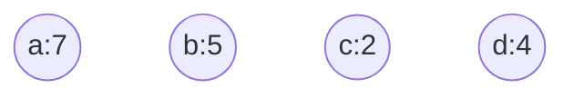
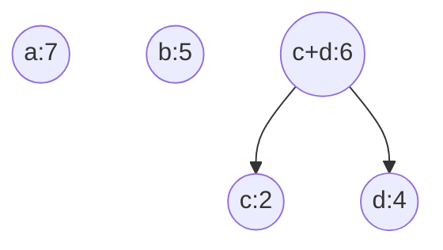
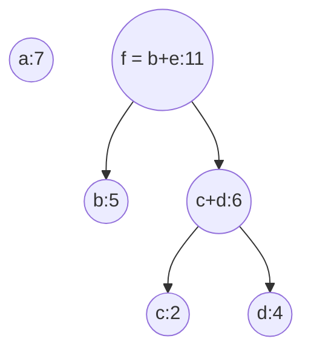
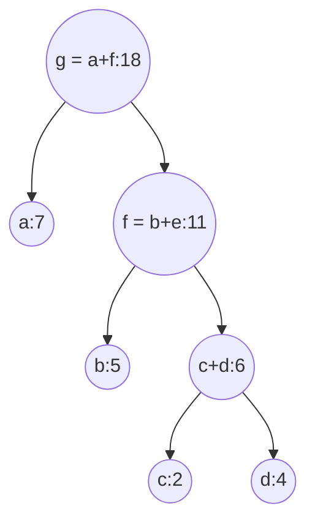

# 树

## 1、普通的树

&emsp;这个好像没什么好说的，唯一就是记住下面一些点。

- 树边与节点关系，边数量=节点数量-1，考虑到个节点都从父亲那边拿了一条边，而根节点没有，所以就差1，做题很好用
- 度为m的树，所有节点之和为$\sum{度为i的节点}$

## 2、二叉树分类

- 满二叉树

- 完全二叉树

- 普通二叉树，这没啥好说的。

## 3、二叉树存储结构

- 顺序存储

  > 对于满二叉树和完全二叉树，最适合了
  >
  > - 结论1、为什么下标为i节点（下标从0开始）的左右孩子分别为2i+1、2i+2，设i节点在第**h**层，i节点**左**边有**m**个，右边有**n**个，左孩子下标为**g**
  >
  >   > 第**0~h-1**层总共有$2^{h-1}-1$个节点
  >   >
  >   > **i**左边有**m**个节点，顺序存储中，i前面就有$2^{h-1}-1+m$个节点
  >   >
  >   > 所以**i**的下标就是$2^{h-1}-1+m$，得到**公式①：**$i=2^{h-1}-1+m$
  >   >
  >   > 第**h**层有$2^{h-1}$个节点，那么得到**公式②：**$2^{h-1} = m+n+1$
  >   >
  >   > **i**与**g**之间应该有$2m+n$个节点，所以有**公式③：**$g-i=2m+n+1$
  >   >
  >   > 联立公式①②③：$g = 2i+1$
  >
  > - 结论2、g节点的父母是$\lceil i/2 \rceil-1$，证明跟上面一样

- 链式存储

  > 左指针，数据域，右指针

## 4、二叉树的性质

&emsp;假设$n_0,n_1,n_2$分别表示度为0，1，2的节点个数，$n$表示总结点个数，$m$表示边，$h$表示高度，下面对**任意二叉树**都成立。

- $n_0 = n_2+1$
- $m = n-1$
- $h = \lceil log_2(n+1) \rceil = \lfloor log_2n+1 \rfloor$
- $2^{h-1}-1 <  n \leq 2^h -1 或 2^{h-1} \leq  n \leq 2^h$

## 5、二叉树的遍历

- 前序遍历

  > 先遍历根节点，再遍历左子树，最后遍历右子树。如果有为空的，直接跳过。

- 中序遍历

  > 先遍历左子树，再遍历根节点，最后遍历右子树。如果有为空的，直接跳过。

- 后序遍历

  > 先遍历左子树，再遍历右子树，最后遍历根节点。如果有为空的，直接跳过。

- 前序遍历与后序遍历序列恰好相反

  > 该二叉树的节点数等于树高
  >
  > 该二叉树的中序遍历便是，依次去掉前序遍历的值和中序的值，接下来的值在中序中的值应该是两边而不是中间。

## 6、线索二叉树

## 7、树与森林

### 1）树的存储结构

- 双亲表示法
- 孩子表示法
- 孩子兄弟表示法

### 2）树、森林、二叉树的转换

|          树          |   森林   |  二叉树  |
| :------------------: | :------: | :------: |
|       先根遍历       | 先序遍历 | 先序遍历 |
| 后根遍历（中根遍历） | 中序遍历 | 中序遍历 |

- 遍历方式

  > - 树
  >
  >   > 先根遍历：先遍历根，再按先根遍历依次遍历子树。
  >   >
  >   > 后根遍历（中根遍历）：先按后根遍历依次遍历子树，再遍历根。
  >
  > - 森林
  >
  >   > 先序遍历：先访问第一棵树的根节点，再按先序遍历依次遍历第一棵树的子树森林，最后遍历森林中剩下的森林。
  >   >
  >   > 中序遍历：先按中序遍历遍历第一棵树的子树森林，再访问根，最后遍历森林剩下的森林。

- 若F是一个森林，B是由F变换成的二叉树

  > - 假设F有n个非终端节点，求B中无右孩子的结点数？
  >
  > 答：F中每一个非终端节点`Node`的m个孩子，转换到B中，应该有一个无右孩子（`Node`的最右边那个孩子）。F中最右边的树的根节点也不会有右孩子的。所以总共无右孩子的节点数为**n+1**。同理，若F是一棵树，也可以推导一些定理。
  >
  > - F中的叶节点和B的关系
  >
  > 答：F中的叶节点数是B中左孩子为空的节点数。因为B中左孩子为空的话，说明在F中没有子树，那么就说明是叶节点。

## 8、哈夫曼树

&emsp;若**没有**一个编码是另一个编码的**前缀**，称这样的编码为**前缀编码**，前缀编码可以被唯一翻译。

- 哈夫曼树：带权路径（WPL）最小的树

- 哈夫曼树构造过程

  > 下面四个节点，字母代表节点名称，数字代码权重
  >
  > 选取所有节点中最小的两个节点，构造新节点代替两个旧节点，一直重复，知道只剩一个节点

&emsp;这样生成的带权路径最短，就是一颗哈夫曼树了。

- 哈夫曼树特点

  > 只有**度为0**和**度为2**的节点：即$n_1 = 0$，且根据树的特点有：$n_0 = n_2 + 1 \quad \Rightarrow \quad n=2n_2+1$
  >
  > **度为m**的哈夫曼树，那就只有**度为0**和**度为m**的两种节点。
  >
  > 一个叶节点对应一个码字

## 并查集

&emsp;通常使用**双亲表示法**的树作为存储结构，注意不一定是二叉树了。每个集合表示为一棵树，所有的集合，表示成为森林了。并查集最重要的三个操作：`Initial(S)初始化`、`Union(S, Root1, Root2)联合`、`Find(S,x)查找`。