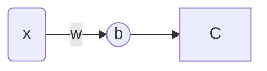
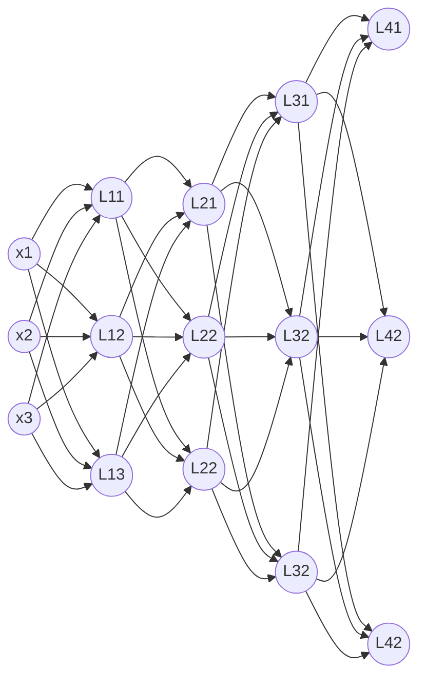

# 前言

最近在做几个人工智能相关的项目，决定写下一些博客来记录学习内容，防止以后忘记一些基础知识，本文不会涉及到很复杂的神经网络，为的就是从数学开始，在草稿本上开始，开始学习神经网络

# 神经网络介绍

摘自百科上一段话：

**人工神经网络**（英语：artificial neural network，ANNs）简称**神经网络**（neural network，NNs）或**类神经网络**，在[机器学习](https://zh.wikipedia.org/wiki/机器学习)和[认知科学](https://zh.wikipedia.org/wiki/认知科学)领域，是一种[模仿](https://zh.wikipedia.org/wiki/仿生學)[生物神经网络](https://zh.wikipedia.org/wiki/生物神经网络)（动物的[中枢神经系统](https://zh.wikipedia.org/wiki/中樞神經系統)，特别是[大脑](https://zh.wikipedia.org/wiki/大脑)）的结构和功能的[数学模型](https://zh.wikipedia.org/wiki/数学模型)或[计算模型](https://zh.wikipedia.org/wiki/计算模型)，用于对[函数](https://zh.wikipedia.org/wiki/函数)进行估计或近似。神经网络由大量的人工神经元联结进行计算。大多数情况下人工神经网络能在外界信息的基础上改变内部结构，是一种[自适应系统](https://zh.wikipedia.org/w/index.php?title=自适应系统&action=edit&redlink=1)，通俗地讲就是具备学习功能。现代神经网络是一种[非线性](https://zh.wikipedia.org/wiki/非线性)[统计性数据建模](https://zh.wikipedia.org/w/index.php?title=统计性数据建模&action=edit&redlink=1)工具，神经网络通常是通过一个基于数学统计学类型的学习方法（learning method）得以优化，所以也是数学[统计学](https://zh.wikipedia.org/wiki/统计学)方法的一种实际应用，通过统计学的标准数学方法我们能够得到大量的可以用函数来表达的局部结构空间，另一方面在人工智能学的人工感知领域，我们通过数学统计学的应用可以来做人工感知方面的决定问题（也就是说通过统计学的方法，人工神经网络能够类似人一样具有简单的决定能力和简单的判断能力），这种方法比起正式的逻辑学推理演算更具有优势。[^1]

# 神经元

下图演示了一个基本的神经元

上图中，圆圈`b`是一个神经元，一般的神经元上会有**偏置（bias）**，`b`会将输出数据传递给下一层神经网络方块`C`表示，`C`也同样做着跟`B`一样工作的这便是神经网络的基本结构，直到神经网络的输出。

在神经元上，一般还要有个非线性功能的函数，叫做**激活函数（Activation Function）**，常见的激活函数有：`relu`, `tanh`, `sigmoid`。

-   设`x`的输出为$x$
-   `b`的输出为$b_o$
-   `b`的偏置为$b$
-   激活函数记为$f$

那么就能得到一个神经元会做如下计算并输出结果给下一层与之连接的神经元，如下公式所示：
$$
b_o = f(wx + b)\\
$$
现在一步步拆分上面的计算顺序：
$$
b_o = wx\\
b_o = b_o+b\\
b_o = f(b_o)
$$

现在，我们已经完成了一个神经元的计算了，其他神经元同理，也就是说，现在就已经明白神经元怎么进行一次计算的了。

# 深度神经网络

## 结构介绍

由于用的`Markdown`，所以神经网络看起来不是很清楚，不过没关系，总之能够看出一层一层的关系即可

-   结构：输入层$L_1$ ，隐藏层$L_2,L_3$，输出层$L_4$，输入的数据是$x=(x_1,x_2,x_3)$
-   $L_{ij}$：表示第$i$层，第$j$个神经元
-   $w_{ijk}$：第$i-1$层的神经元$j$输入到第$i$层神经网络的神经元$k$​​的权重
-   $W_i$：第$i$层的权重矩阵
-   $b_{ij}$：神经元$L_{ij}$的偏置
-   $B_i$：第$i$层神经元的偏置矩阵
-   $x_{ijk}$：表示第$i-1$层的神经元$j$输入到第$i$层神经元$k$的输入
-   $y_{ij}$：表示第$i$层神经元$j$的输出

## 计算第一层

下面来简单的计算一下逐步计算第一层输入层$L_1$

1.   乘以权重

$$
I_{1} = (I_{11}, I_{12}, I_{13}) \\
= x\times W_1 \\
= (x_1,x_2,x_3)\times \left( \begin{matrix}
w_{11} & w_{12} & w_{13}\\
w_{21} & w_{22} & w_{23}\\
w_{31} & w_{32} & w_{33}
\end{matrix} \right)
$$

2.   计算偏置

$$
I_1^{'} = (I_{11}^{'}, I_{12}^{'}, I_{13}^{'})\\
= I_1 + B_1\\
= (I_{11}, I_{12}, I_{13}) + (b_{11}, b_{12}, b_{13})
$$

3.   非线性操作

$$
Y_{1} = (Y_{11}, Y_{12}, Y_{13}) \\
= f_1(I_1^{'})=(f_{11}(I_{11}^{'}), f_{12}(I_{12}^{'}), f_{13}(I_{13}^{'}))
$$

其实大部分说来，一层或者整个神经网络结构都是一样的激活函数，可以直接记为$f(I_1^{'})$就行

## 计算后续层

由上述计算的隐藏层$L_1$的输入继续计算第二层即可，只需要简单的把$O_1$换成$x$，把其他参数换成第二层的即可，如果用矩阵表示的话：
$$
Y_1 = f(xW_1+B_1)\\
Y_2 = f(Y_1W_2+B_2)\\
Y_3 = f(Y_2W_3+B_3)\\
\hat y = Y_3W_y+B_y
$$
输出层一般是没有激活函数的，经过上述计算，就可以得到经过神经网络的预测值$\hat y$了

## 损失函数

损失函数是评估神经网络输出值与真实参考值之间的误差的，常见的损失函数有：`MSELoss`, `CrossEntropyLoss`, `L1Loss`, `NLLLoss`等等，然后可以计算损失值
$$
L_{oss}=l(\hat{y}, y)
$$

## 激活函数的作用

假设上述激活函数没有，那么式子会变成什么样的呢？
$$
Y_1 = xW_1+B_1\\
Y_2 = Y_1W_2+B_2\\
Y_3 = Y_2W_3+B_3\\
\hat y = Y_3W_y+B_y = \{[(xW_1+B_1)W_2+B_2]W_3+B_3\}W_y+B_y\\
= [(xW_1+B_1)W_2+B_2]W_3W_y+B_3W_y+B_y\\
=(xW_1+B_1)W_2W_3W_y+B_2W_3W_y+B_3W_y+B_y\\
=xW_1W_2W_3W_y+B_1W_2W_3W_y+B_2W_3W_y+B_3W_y+B_y\\
=xW+B
$$
算到最后发现，原来多层隐藏层就变成了一层隐藏层的功能

# 参数更新

[梯度下降与反向传播](https://lmzyoyo.top/archives/gtandbp)

# 参考链接

[^1]: 维基百科编者. 人工神经网络[G/OL]. 维基百科, 2024(20240310)[2024-03-10]. [https://zh.wikipedia.org/w/index.php?title=%E4%BA%BA%E5%B7%A5%E7%A5%9E%E7%BB%8F%E7%BD%91%E7%BB%9C&oldid=81838422](https://zh.wikipedia.org/w/index.php?title=人工神经网络&oldid=81838422).