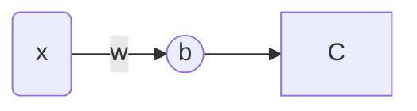
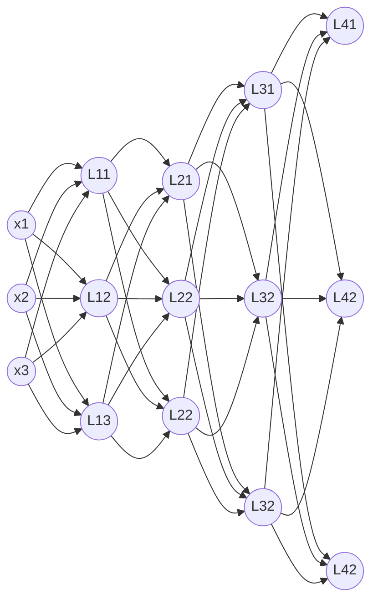

# 梯度与梯度下降

## 简单介绍

摘自百科上的一段话：

**梯度**（英语：gradient）是一种关于多元[导数](https://zh.wikipedia.org/wiki/导数)的概括。平常的一元（单变量）[函数](https://zh.wikipedia.org/wiki/函数)的导数是[标量值函数](https://zh.wikipedia.org/wiki/标量值函数)，而[多元函数](https://zh.wikipedia.org/wiki/多元函数)的梯度是[向量值函数](https://zh.wikipedia.org/wiki/向量值函数)。[多元](https://zh.wikipedia.org/wiki/多元函数)[可微函数](https://zh.wikipedia.org/wiki/可微函数)𝑓在点𝑃上的梯度，是以𝑓在𝑃上的[偏导数](https://zh.wikipedia.org/wiki/偏导数)为分量的[向量](https://zh.wikipedia.org/wiki/向量)。[^1]

通俗的话来说，多元函数的梯度，是由每个偏导数组成的向量，每一点的梯度方向就是多元函数在该点梯度值所表示得向量方向。对于一元函数来说，梯度就相当于一元函数的微分/导数，下面从一元函数开始出发，演示一下梯度是如何作用的。

## 一元函数导数

对于函数$f(x)=x^2$，其导数为$f^{'}(x)=2x$来说，很容易知道其极值点/最小值点在$x=0$取得，即$f_{\min}(x)=f(0)=0$。那么如何用梯度下降的方法来让计算机寻找极值/最值呢？

1.   随机取一个$x=x_0$，在该点的导数值（“梯度值”）为$f^{'}(x)=2x_0$
2.   更新参数，利用梯度值如何更新呢？梯度下降法，顾名思义，沿着梯度的负方向更新即可，就变成：$x_{new}=x-f^{'}(x)=x_0-2x_0=-x_0$
3.   我们发现，$x$确实更新了，而且变成了$-x_0$，但是又发现一个问题，距离真的极值点的距离没有变。
4.   继续按照上述方法计算下去，明显都不收敛了，所以需要引入一个机制让过程收敛才行——那便是**学习率**，记为$l_r$，通常取很小的值，比如$l_r=0.1$​

引入学习率$l_r=0.1$之后，会发生什么呢？

2.   继续第二步，$x_{new}=x-l_r\times f^{'}(x) = x_0-0.1\times2x_0=0.8x_0$，发现离真实值近了很多。
3.   不如继续用这种方法更新，假设$x_0=1000$，那么在进行100次之后，$x_0\approx2.04\times10^{-7}$，$f(x_0)\approx4.15\times10^{-14}$​，很明显非常接近真实值了。

## 多元函数梯度

对于函数$f(x,y)=x^2+y^2$，其偏导数为$\frac{\partial f}{\partial x}=2x,\frac{\partial f}{\partial y}=2y$，极值点也很明显在$(x,y)=(0,0)$取得。

1.   随机选取初始值$X=(x_0,y_0)$，同样的分别求出该点的偏导数值，然后利用更新公式进行更新
2.   $X_{new}(x,y)=(x_0-l_r\times2x_0,y_0-l_r\times2y_0)$，计算个许多次，就可以发现该函数收敛了

## 一个思考

上述两个例子，都是直接把导数的解析式写出来的，但是在神经网络这么多参数中，不可能都写出导数解析式，该如何求这个导数呢？而且，神经网络如何快速求导数来快速更新参数呢？下面就要讲到反向传播的原理了。

# 反向传播

## 简单介绍

摘自百科上的一段话：

**反向传播**（英语：Backpropagation，意为**误差反向传播**，缩写为**BP**）是对多层[人工神经网络](https://zh.wikipedia.org/wiki/人工神经网络)进行[梯度下降](https://zh.wikipedia.org/wiki/梯度下降法)的算法，也就是用[链式法则](https://zh.wikipedia.org/wiki/链式法则)以网络每层的权重为变量计算[损失函数](https://zh.wikipedia.org/wiki/损失函数)的梯度，以更新权重来最小化损失函数。[^2]

简单来说，反向传播是为了快速更新权重的方法。所以一次神经网络的计算会分为两个步骤，先进行前向传播计算预测值，然后再反向传播链式更新参数。

## 单个神经元的反向传播

***注：***先前的一元/多元函数例子中，并没有介绍什么是损失函数，也没有关注损失函数是啥。而是简单用函数来替代损失函数了（上述损失函数实际上是：$L_{oss}(x)=x^2$以及$L_{oss}(x,y)=x^2+y^2$），仅仅是因为这两个函数可以反应与真实值的误差，因为梯度下降法是要求损失函数关于各个参数的偏导数，下面会引入损失函数来计算。

---

先用单个神经元举例子

$x$经过上述神经元计算出来的是预测值$\hat{y}=f(wx+b)$，其中$w$是权重，$b$是偏置，$f$是激活函数，假设真实值输出为$y$，损失函数记为$l$。

我们可以写出损失函数来：$L_{oss}=l(\hat{y},y)$。这里有两个量需要更新，一个是权重，一个是偏置。
$$
\frac{\partial l}{\partial w}&=\frac{\partial l}{\partial\hat{y}}\times\frac{\partial\hat{y}}{\partial w}\\
&=\frac{\partial l}{\partial\hat{y}}\times\frac{\partial\hat{y}}{\partial w}\\
\frac{\partial l}{\partial b}&=\frac{\partial l}{\partial\hat{y}}\times\frac{\partial\hat{y}}{\partial b}\\
&=\frac{\partial l}{\partial\hat{y}}\times\frac{\partial\hat{y}}{\partial b}
$$
由高等数学可知上述的公式（假设激活函数可导）。假设损失函数为`MSELoss`，激活函数为`sigmoid`：
$$
loss: \frac{1}{n}\sum\limits_{i=1}^n(\hat{y}_i-y_i)^2\\
sigmoid: S(x)=\frac{1}{1+e^{-x}},\quad S^{'}(x) = \frac{e^{-x}}{(1+e^{-x})^2}=S(x)(1-S(x))
$$
下面来分布计算一下每个函数过程，先是在输出层`C`处的计算
$$
l(\hat{y},y)=(\hat{y}-y)^2,\quad \frac{\partial l}{\partial\hat{y}}=2(\hat{y}-y)
$$
上述式子可以计算出第一步来，而且只需要代值进去即可。然后在神经元`b`处的计算
$$
\hat{y}=f(wx+b)=\frac{1}{1+e^{-(wx+b)}},\\
\frac{\partial\hat{y}}{\partial w}=xS(wx+b)\left(1-S(wx+b)\right)=v_w\\
\frac{\partial\hat{y}}{\partial b}=S(wx+b)\left(1-S(wx+b)\right)=v_b\\
$$
可以看出，在某一层计算的时候，只需要下一层给一个值，然后就能够在当前进行计算了，然后利用更新式子更新即可$w_{new}=w-l_r\times v_w,b_{new}=b-l_r\times v_b$，实现反向传播，下面给出多层的例子。

## 多层神经元举例子

用下述神经网络举例子

之前的博客已经讲过了前向传播，符合记法也在之前的博客中有，前向传播就是从输入到输出。假设已经完成了前向传播，现在开始反向传播。

继续假设损失函数为`MSELoss`，激活函数为`sigmoid`

1.   先计算损失值，并写出损失函数

$$
L_{oss}=l(\hat{y}_1,\hat{y}_2,\hat{y}_3,y_1,y_2,y_3)=\frac{1}{3}\left[(\hat{y}_1-y_1)^2+(\hat{y}_2-y_2)^2+(\hat{y}_3-y_3)^2\right]\\
\frac{\partial l}{\partial\hat{y}_1}=\frac{2(\hat{y}_1-y_1)}{3}
$$

2.   先算输出层，一层中各个神经元之间并没有什么练习，所以对某个神经元偏导是不会包含其他神经元的参数的。记任何一层神经元的输入为$X_i\quad(i=1,2,3,y)$，某个神经元的输入就是$x_{ij}\quad (i=1,2,3,y),(j=1,2,3)$，下面来计算`y1`这个神经元吧

$$
\frac{\partial l}{\partial w_{411}}&=\frac{\partial l}{\partial\hat{y}_1}\cdot\frac{\partial\hat{y}_1}{\partial w_{411}}\\
&=\frac{\partial l}{\partial\hat{y}_1}\cdot x_{411}
$$

3.   还有一个点需要被意识到，$x_{411}$实际上也是$y_{31}$，也就是`L31`的输出，我们在前向传播中已经求过了，这里可以直接用，就能够非常快的求出上述式子的导数值了，记为$v$，根据梯度下降法可以很快的更新参数了，$w_{411}=w_{411}-l_r\times v$，即可更新一次
4.   继续计算`L31`这一层的权重，这里有三个的原因是，`L31`这个神经元经过三条路才到达损失函数，`L31->L41, L31->L42, L31->L43`，因为`L31`和后一层是全连接的

$$
\frac{\partial l}{\partial w_{311}}=\frac{\partial l}{\partial\hat{y}_1}\cdot\frac{\partial\hat{y}_1}{\partial x_{411}}\cdot\frac{\partial x_{411}}{\partial w_{311}}
+\frac{\partial l}{\partial\hat{y}_2}\cdot\frac{\partial\hat{y}_2}{\partial x_{412}}\cdot\frac{\partial x_{412}}{\partial w_{311}}
+\frac{\partial l}{\partial\hat{y}_3}\cdot\frac{\partial\hat{y}_3}{\partial x_{413}}\cdot\frac{\partial x_{413}}{\partial w_{311}}
$$

5.   用同样的方法来计算上述公式，就以第一项为例

$$
\frac{\partial l}{\partial\hat{y}_1}\cdot\frac{\partial\hat{y}_1}{\partial x_{411}}\cdot\frac{\partial x_{411}}{\partial w_{311}}
$$

6.   计算上述公式，第一项不用说了，前面算过了

     1.   值得注意的是，$\hat{y}_1=x_{411}+x_{421}+x_{431}$，所以中间这一项为1，不用算

     2.   对于右边这一项，由于引入了激活函数，所以还需要计算激活函数的值

$$
\frac{\partial x_{411}}{\partial w_{311}}=y_{31}f^{'}(w_{311}y_{31}+b_{31})
$$

7.   同样，可以快算在该层算出来，继续用梯度下降法更新即可

# 参考链接

[^1]:维基百科编者. 梯度[G/OL]. 维基百科, 2023(20230917)[2023-09-17]. [https://zh.wikipedia.org/w/index.php?title=%E6%A2%AF%E5%BA%A6&oldid=78965959](https://zh.wikipedia.org/w/index.php?title=梯度&oldid=78965959).
[^2]:维基百科编者. 反向传播算法[G/OL]. 维基百科, 2024(20240108)[2024-01-08]. [https://zh.wikipedia.org/w/index.php?title=%E5%8F%8D%E5%90%91%E4%BC%A0%E6%92%AD%E7%AE%97%E6%B3%95&oldid=80417683](https://zh.wikipedia.org/w/index.php?title=反向传播算法&oldid=80417683).
