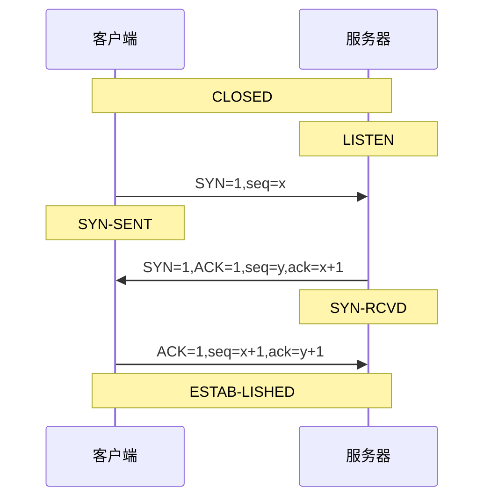
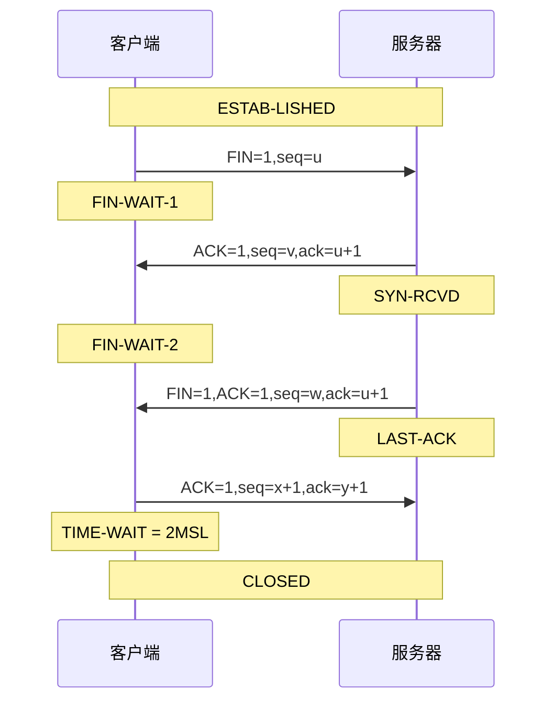

# PPP

## 介绍

- PPP协议应用于 **广域网** 的 **数据链路层** ，并且还可以有PPPoE，即PPP协议加以太网协议
- PPP既支持 **异步（字节）** 链路，也支持  **同步（比特）** 链路，常见是 **异步** 
- 帧格式：F(7E)   A(FF)   C(03)   IP数据报   FCS(CRC检验)   F(7E)
- 字节填充：`7E` => `7D 5E`，`7D` => `7D 5D`，`03` => `7D 23`所有小于`0x20`都需要跟`0x03`一样变化
- 比特填充：每5个`'1'`填充1个`'0'`
- **LCP（Link Control Protocol）**：链路控制协议，控制链路层的连接建立
- **NCP（Network Control Protocol）**：网络控制协议，控制网络层的连接建立

## 过程


# ARP

## 介绍

- 用于`IP`地址查找`MAC`地址，工作于`TCP/IP`的网络层，`OSI`的数据链路层

- 值得注意的是

  > 二层交换机下：能够得到目标主机的`MAC`
  >
  > 路由器下：非局域网只能得到路由器的`MAC`，局域网则可以得到目的主机的`MAC`

## 过程

- 局域网与非局域网区别在于是否走了路由器代理
- `A`进行`ARP`求得`B`的`MAC`
- 首先检查`ARP`高速缓存表
- `A`广播一个`MAC`帧，目的地址为`FF-FF-FF-FF-FF-FF`。其中携带的数据有A的`MAC`地址
- 局域网所有主机都将收到该帧，但是只有`B`做出回应
- `B`对`A`发送单播`arp`响应报文
- `arp`高速缓存都会设置生存时间，过了生存时间将会删除该条缓存

# 交换表

## 介绍

- 交换机具有自学习能力，能够自动构建动态交换表
- 格式：MAC地址，端口

## 过程

- 初始交换表为空
- `A`发送了一帧数据，交换机记录`A`的`MAC`和端口
- 将该帧数据转发到除`A`以外的所有端口
- `B`对`A`回应，发送给交换机
- 交换机记录下`B`的`MAC`和端口

# 802.3以太网

## 介绍

- 一开始拆成 **逻辑链路控制LLC** 和 **媒体接入控制MAC** 两层，后面只剩下 **MAC**
- 帧格式：前导码7B   帧开始定界符1B   目的MAC   源MAC   类型   IP数据报   FCS(CRC检验)
- 以太网是以太网，802.3是802.3，一个是事实协议，一个是规范协议，只学事实协议
- 802.3中类型字段大于`0x0600`表示类型，否则表示长度。

## CSMA/CD

载波监听多点接入/碰撞避免：Carrier Sense Multiple Access with Collision Detection

- 碰撞发生时，退避算法

  > 基本退避时间为 $2\tau$ ，即争用期/往返时延/两倍端到端时延
  >
  > $k=\min[重传次数，10]$，从$[0,1,...,(2^k-1)]$ 中随机选出一个数 $r$ 
  >
  > 重传时间为 $r\times 2\tau$

## CRC计算过程

- 多项式为：$P(X)=a_nX^n+a_{n-1}X^{n-1}+...+a_1X^1+a_0X$，其中$a_n$为`1`或`0`
- 那么设除数$p=a_na_{n-1}...a_1a_0$ 为二进制表示，共有 `n+1` 位
- 数据添上`n`位`0`之后，对p进行模2除法（步骤等同于普通除法，但是相减的过程变成异或）
- 得到余数添加到数据后面就是发送的数据帧
- 验证的话：用接收到的数据帧对`p`进行模2除法，得到0就是没有差错

# 802.11无线局域网

## 介绍

- 无线局域网中心叫做 **接入点AP** 
- 帧格式：帧控制2B   持续期2B   地址1   地址2   地址3   序号控制2B   地址4   帧主体(0-2312B)   FCS(CRC)4B
- 帧控制：协议版本2bit   类型2bit   子类型4bit   去往AP1bit   来自AP1bit   更多分片1bit   重试1bit   功率管理1bit   更多数据1bit   WEP1bit   顺序1bit
- RTS格式：帧控制2B   持续期2B   接收地址   发送地址   FCS
- CTS和ACK帧格式：帧控制2B   持续期2B   接收地址   FCS
- 因为涉及三台设备（sender，receiver，AP），所以有三个地址
- 地址1：接收地址
- 地址2：发送地址
- 地址3：源地址或者目的地址（地址1和地址2除外的地址）
- DIFS：分布协调功能帧间间隔
- SIFS：短帧间间隔

## 建立连接过程

- 被动扫描

  > AP周期（如10次/s）发出 **信标帧**，包含SSID以及支持的速率等信息
  >
  > 移动站A扫描到11个信道，选择想加入的AP，向该AP发送 **关联请求帧**
  >
  > 该接入点AP发送 **关联响应帧** 给A

- 主动扫描

  > 移动站A广播发送 **探测请求帧**
  >
  > 多个接入点AP回答 **探测响应帧**
  >
  > 移动站向想要的AP发送 **关联请求帧**
  >
  > 该AP回答 **关联响应帧**

## 隐蔽站问题

- B----AP----C

- AP与B之间有信号，AP与C之间有信号，但是B与C之间没有信号，那么就有隐蔽站问题

- 解决：

  > B或者C发送数据之前，需要发送 **请求发送RTS** 帧，内容为将要占用的时间
  >
  > AP收到`RTS`后响应 **允许发送CTS** 帧，不仅仅是响应B，同时告诉C，现在有人在发送数据

## CSMA/CA协议

载波监听多点接入/碰撞避免：Carrier Sense Multiple Access with Collision Avoidance

- 发送数据需要先监听，若在DIFS时间内为空，则发送

- 否则，选择一个随机数，设置退避定时器。

- 计时器规则：

  > 信道忙，定时器不动，直到信道空闲
  >
  > 信道空闲，并在DIFS内仍然是空闲，则开始争用信道（开始倒计时）

- 成功发送数据，SIFS之后应该开始接收ACK

- 再次发送数据或者没收到ACK进行重传，则需回到第二步，并且随机数选择范围更大

SIFS与DIFS作用：每次发送都需要等待DIFS，SIFS是小于DIFS的，那么如果没有人发送数据，则DIFS内应该一直空闲

什么帧能够等待SIFS就可以发送了：ACK与CTS

# DHCP

## 介绍

- 动态主机配置协议：Dynamic Host Configuration Protocol
- 装载于`udp`数据报中，客户端口号68，服务器端口号67
- 租用期：DHCP只能够租用一段时间，1s到136年，校园网常用1小时

## 过程

- 服务器监听udp:67
- 客户发送 **DHCP发现（DHCPDISCOVER）**  报文，目的 255.255.255.255，源 0.0.0.0
- 所有的DHCP服务器都回应 **DHCP提供（DHCPOFFER）** 报文，目的 255.255.255.255，源 dhcp服务器地址
- 客户选择一个DHCP服务器，并向该服务器发送 **DHCP请求报文（DHCPREQUEST）**，目的 255.255.255.255，源 0.0.0.0，并且数据中携带选择的IP地址
- dhcp-serve发送 **DHCPACK** ，客户可以用上一步的临时IP了，已绑定状态，数据中携带了租用期 T
- 租用期过了一半，客户重新发送 **DHCPREQUEST**
- 服务器不同意，发送 **DHCPNACK** ，客户需要重新申请IP，放弃使用该地址
- 服务器同意，发送 **DHCPACK**，继续更新了租用期
- 如果服务器没发送，客户需要在 0.875T 时再次发送 **DHCPREQUEST**
- 客户需要提前终止，只需要发送 **DHCPRELEASE** 即可

# RIP

UDP数据报，端口520

## 

# OSPF

IP数据报，协议89


# BGP

TCP数据报，端口179


# SNMP

## 介绍

- 简单网络管理协议，Simple Network Management Protocol
- 使用UDP
- 管理信息结构SMI：命名被管的对象（即未被管对象生成uid）；编码规则
- 管理信息库MIB：定义了被管对象的参数，如时间、接口等

# VLAN

- 虚拟局域网：Virtual LAN，802.1Q
- 一个虚拟局域网是一个广播域
- 帧格式：目的MAC   源MAC   VLAN标签4B   类型2B   数据(46-1500B)   FCS4B(CRC)
- VLAN标签：802.1Q标签类型2B，标签控制信息（4位+12位VID）
- 对于主机来说，不知道自己处于那个VLAN，这个只有交换机直到
- 主机与交换机通信，采用802.3帧，交换机之间采用802.1Q帧
- 因此，虚拟局域网可以横跨多个路由器

# 令牌环网

- 物理拓扑不一定是环，逻辑拓扑是环网
- 网络中有一块令牌，一直在循环传送，如果有数据要发送，就把数据装在令牌上，依次传送

# VPN

- 虚拟专用网，Virtual Private Network
- 通过互联网数据需要加密

# MPLS

- 多协议标签交换：MultiProtocol Label Switching
- 该协议用来加快转发
- 转发表：入接口   入标签   出接口   出标签

# TCP握手




# TCP挥手




# HTTP

# ICMP

- 网际控制报文协议：Internet Control Message Protocol

- ICMP差错报告报文，ICMP询问报文

- ICMP差错报告报文

  > 终点不可达，类型3，不能交付
  >
  > 时间超过，类型11，TTL到了
  >
  > 参数问题，类型12，首部字段不正确
  >
  > 改变路由（重定向），类型5，路由器告诉主机需要更改路由

- ICMP询问报文

  > 回送请求或回送回答
  >
  > 时间戳请求或事件戳回答

- 如下情况，不发送ICMP差错报文

  > - 对ICMP差错报告报文
  > - 对第一个分片的数据报的所有后续数据报
  > - 对具有多播地址的数据报
  > - 对特殊地址（127.0.0.1或0.0.0.0）

- ping：使用ICMP报文

- traceroute：依次发送TTL为0的三个数据报，然后依次增加TTL再发送三个数据报，重复。因为目的主机IP数据报无法交付UDP，所以回送ICMP终点不可达报文

# IGMP

- 网际组管理协议：Internet Group Management Protocol

- **多播IP转多播MAC**：

  > 多播IP：D类地址，1110开始，接下来5位不使用，后面剩下23位，32位
  >
  > 多播MAC：`01 00 5E`不变，0 + 上面的23位，48位

# NAT

- 网络地址转换：Network Address Translation
- 从本网络发到外部网络：源IP:源端口 => 路由器的IP:新源端口，目的IP端口不变
- 从外部网络发到本网络：目的IP:目的端口 => 主机IP:主机端口，源IP端口不变

# STMP

## 介绍

- 简单邮件传送协议
- TCP:25

## 步骤

- TCP之后，SMTP-serve 发送 "220 Service ready"
- SMTP-client 发送 HELO（注意没有拼错），附上发送方主机名
- 若SMTP-serve可以接收，则发送“250 OK”，否则发送“421 Service not available”
- 邮件格式：c是SMTP-client, s是SMTP-serve

```shell
c->s: MAIL FROM: <xxx@mail.example.com>
s->c: 250 OK # 或者 451(处理时出错)  452(存储空间不够)  500(命令无法识别)
c->s: RCPT TO: <收件人地址>  # 可重复多次改行
s->c: 250 OK # 550 No such user here
s->c: 354 Start mail input; end with <CRLF> # 或者421(服务器不可用) 500
c->s: 邮件内容
s->c: 250 OK

# 连接释放
c->s: QUIT
s->c: 同意释放之后TCP释放
```


# POP3, IMAP

- POP3不能保存到服务器上，读取后服务器会删除
- IMAP可以保存到服务器上，读取后不会删除，犹如在本地操作一样的

# 路由器


- 路由选择：控制层面
- 分组转发：数据层面

# SDN

- 软件定义网络
- 使用OpenFlow
- 南向：控制器与转发设备的接口；北向：用户编程与控制器接口